## **Day 1: Routing & Action Results**  

#### **1. Routing and Endpoints**  
- **Routing Map**: Defines how URLs map to controllers and actions.  
 ``` lua
  /Emp/<ClassName>/Index<FunctionName>
 ```  
- **Endpoint**: The URL path that leads to a function.  
- **Action**: The function that performs the operation.  

### **2. Action Result Types**  
Different return types in controllers:  

| Return Type      | Class                |
| ---------------- | -------------------- |
| `string`         | `ContentResult`      |
| `View`           | `ViewResult`         |
| `json`           | `JsonResult`         |
| `File`           | `FileResult`         |
| `NotFound()`     | `NotFoundResult`     |
| `Unauthorized()` | `UnauthorizedResult` |

#### **Example: Returning Different Results**
``` csharp
public ViewResult Show()
{
    ViewResult view = new();
    view.ViewName = "View1";
    return view;
}
public ContentResult Say()
{
    ContentResult content = new();
    content.Content = "Hello World";
    return content;
}
public IActionResult Mix(dynamic id)
{
    if (id % 2 == 0)
    {
        return Content("Hello From Content Result");
    }
    return View("View1");
}
```

***Note :***
***`IActionResult`*** is an **interface** in ASP.NET Core MVC that represents the result of an action method in a controller. It allows you to return different types of responses, such as views, JSON data, HTTP status codes, or redirections.

#### How o Write Code At View :
```csharp
<h1>Hellow World From First View</h1>
<style>
h1{
    color:red
}
</style>
<script>
console.log("Hello");
</script>
<!--Razor Engin-->
<!--Block Code-->
@{
    int x =10 ;
    int y = x +10;

}
<!--Inline Statment-->
<h2>@x</h2>
@y
<!--Condition statment-->
@if (x > y){

    <h2>X ggreater than y</h2>
}
else
{
    <h2>X = @x Less than y =@y</h2>

}


<!--Looping Statment-->
@for(int i = 0; i < 10; i++)
{
    <li>@i</li>
}

```

---

##                    **Day 2: Data Passing Methods**  

### **1. Passing Data from Action to View**  
`@model` takes **one data type**, but we have three methods to pass multiple data types:  

1. **ViewData**  
   ```csharp
   ViewData["str"] = Object;
   ```
   - Type: `Dictionary<string, Object>`
   - Requires **casting** when retrieving data.

2. **ViewBag**  
   ```csharp
   ViewBag.Property = dynamicValue;
   ```
   - Type is **determined at runtime** (no need for casting).
   - **Both ViewData and ViewBag** **Not Strongly Typed**  (detect to runtime errors)
   - `ViewData` and `ViewBag` both use ==the same dictionary internally==. So you cannot have ViewData matches with the Key property name of ViewBag

3. **ViewModel (Recommended)**  
   - Create a **class** to hold all required data and pass an object to the view.
   - Strong Typed View
   - Example :
### At Controller
   ``` csharp
public IActionResult Details(int id)
{
    string msg = "Hello From Action";
    int temp = 50;
    List<string> bracnches= new List<string>();
    
    bracnches.Add("Assiut");
    bracnches.Add("Alex");
    bracnches.Add("Cario");
    //Aditional info send to View from Action
    ViewData["Msg"] = msg;
    ViewData["Temp"] = temp;
    ViewData["brch"] = bracnches;
    
   
    ViewData["Color"] = "Blue";
    ViewBag.Color = "REd";
    //ViewData.Model=empMo
    Employee EmpMOdel= context.Employee.FirstOrDefault(e => e.Id == id);
    return View("Details", EmpMOdel);
}
     ```

### At View:
``` csharp
@model Employee

@{
    ViewData["Title"] = "ITI Details";
}

<h1>Details</h1>

<h2 style="color:@ViewBag.Color">@Model.Name</h2>
<h1>@ViewData["Msg"]</h1>
<h2>@(int.Parse(ViewData["Temp"].ToString())-10)</h2>

<h2>@(ViewBag.Temp - 10)</h2>


<select class="form form-control">
    @foreach (var item in (List<string>)ViewData["brch"])
    {
        <option>@item</option>
    }
</select>

<select class="form form-control">
    @foreach (var item in ViewBag.brch)
    {
        <option>@item</option>
    }
</select>
```
---
##                                 StateManagement 
### **2. Data Persistence (Session, TempData, Cookies)**  

When a request is made, the **controller object is created and destroyed** after execution.  
To persist data across requests or getting some data from the Object , use:  

| Feature         | TempData                                                     | Session                                              | Cookies                                        |     |
| --------------- | ------------------------------------------------------------ | ---------------------------------------------------- | ---------------------------------------------- | --- |
| **Scope**       | Request + Next request (unless `Peek()` or `Keep()` is used) | Multiple requests during a session                   | Persistent across requests & browsers          |     |
| **Storage**     | Stored in **Session (by default)**                           | Stored in **Server memory**                          | Stored **on the client’s browser**             |     |
| **Lifetime**    | Expires after **one request** (unless `Keep()` is used)      | Expires **when session ends** (`IdleTimeout`)        | Expires **based on `Expires` property**        |     |
| **Persistence** | Survives **redirects** but not full refreshes                | Survives **full refresh, redirects, and navigation** | Survives **browser restarts (if not expired)** |     |
| **Use Case**    | Passing temporary data **between two actions**               | Storing **user-specific data** during a session      | Storing **small, persistent user preferences** |     |
#### **1. TempData**
- Stored temporarily between ==**two actions** (request-to-request).==
- By default, **TempData is deleted after being read**.  
- Use `.Keep("Key")` to persist data across multiple requests.  
- Use `.Peek("Key")` to read without deleting.
##### **Example Using `TempData`**
```csharp
public IActionResult Index()
{
    TempData["Msg"] = "Hello From Session";
    TempData.Keep("Msg"); // Prevents deletion
    return Content($"{TempData["Msg"].ToString()}");
}

public IActionResult Test()
{
    string? msg = TempData["Msg"]?.ToString() ?? "Default Value";
    TempData.Keep("Msg");
    return Content(msg);
}
```
✅ Instead of `Keep()`, use `Peek("Key")` to prevent deletion.
```csharp
public IActionResult Index()
{
    TempData["Msg"] = "Hello From Session";
    return Content($"{TempData.Peek("Msg").ToString()}");
}

public IActionResult Test()
{
    string? msg = TempData.Peek("Msg").ToString();
    return Content(msg);
}
```

---

#### **2. Session**

 - 1. **Session Creation:**
    
    - When a user first sends a request to the server (e.g., by visiting a website), the server creates a **session** for that user.
        
    - The server generates a **unique session ID**, typically a random string or number.
        
    - This ***<span style = "Color : Green">Session ID</span>*** is stored in a ***<Span style = "color : green">Cookie</Span>*** on the user's browser , but the ***<span style="Color:green">actual data</span>*** stored in ***<Span style="Color:green">Server</Span>***
        
2. **Session ID Sent with Each Request:**
    
    - For every subsequent request, the browser **automatically sends the session ID** (usually as a cookie) along with the request.
        
    - The server checks the session ID that it receives from the request and compares it with the sessions it has stored on the server (typically in memory or a session database).
        
3. **Session Validation:**
    
    - If the session ID matches an active session stored on the server, the server knows that this is a **valid session** and continues to associate the user’s actions with that session.
        
    - If the session ID is missing or invalid (e.g., expired), the server may either create a new session or prompt the user to log in again.
        
4. **Session Expiration/End:**
    
    - Sessions typically have a **timeout period**, after which they expire automatically. If the user doesn't interact with the server within that timeout, the session is considered **expired**.
        
    - The session can also be explicitly destroyed by the server when the user logs out, or after a predefined time.

- Data is stored ==**on the server**== and accessible across multiple actions/views.


##### **Example Using `Session`**
```csharp
public IActionResult SetSession(string name)
{
    HttpContext.Session.SetString("Name", name);
    HttpContext.Session.SetInt32("Age", 21);
    return Content("Data Session Save Success");
}
public IActionResult GetSession()
{
    string n = HttpContext.Session.GetString("Name");
    int? a = HttpContext.Session.GetInt32("Age");

    return Content($"name={n} \t age={a}");
}


// For Object instance 
public IActionResult Set_SessionObj(Student obj)
{
    var key = "My_Key";
    var str = JsonConvert.SerializeObject(obj);
    HttpContext.Session.SetString(key, str);
    return Content("Object is Set Successfully");
}

public IActionResult Get_SessionObj(string key)
{
    var str = HttpContext.Session.GetString(key);
    var str = HttpContext.Session.GetString(key);
    var obj = JsonConvert.DeserializeObject<Student>(str);
    return Content("Obj Is Retrieved ");
}
```

- Requires **configuration in `Program.cs`**.
#### At Main Function :
``` csharp
 builder.Services.AddSession(options => {
     options.IdleTimeout = TimeSpan.FromMinutes(30);
 });
 
 //or 
  builder.Services.AddSession(); // Default Time is 20 min
 
  // then After or Before ` app.UseRouting(); ` Put : 
  app.UseSession();
```

so , 
``` csharp
public static void Main(string[] args)
{
    var builder = WebApplication.CreateBuilder(args);

    // Add services to the container.//Day8
    builder.Services.AddControllersWithViews();
    
    
    builder.Services.AddSession(options => {
        options.IdleTimeout = TimeSpan.FromMinutes(30);
    });
    var app = builder.Build();

    # region Built-in Middleware
    // Configure the HTTP request pipeline.//Day4 (Middleware)
    if (!app.Environment.IsDevelopment())
    {
        app.UseExceptionHandler("/Home/Error");
    }
    app.UseStaticFiles();
    
    app.UseSession();
    
    app.UseRouting();

    app.UseAuthorization();

    app.MapControllerRoute(
        name: "default",
        pattern: "{controller=Home}/{action=Index}/{id?}");
    //app.Map("/djhsdjh", (app) => { });
    #endregion
    
    app.Run();
}
     
```

---

#### **3. Cookies**
- The session ID stored in the cookie is only used by the browser to **identify the session**
- it doesn’t store user data (just the ID).
- Cookie Data is stored ***<span style ="color : gold;">on the client’s browser</span>***.
- **Cookies** are sent back to the server automatically with each request, allowing the server to retrieve session-specific data (like user authentication, preferences, etc.).
- Can set expiration time.
- Cookies Are Added in <Span style="Color:gold">Response </Span>
- <span style="Color:gold">Request</span> is used for <span style="Color:Gold">Read Only</span>

##### **Example Using `Cookies`**
```csharp
 public IActionResult SetCookie()
 {
     CookieOptions options=new CookieOptions();
     options.Expires = DateTime.Now.AddDays(1);    
     //Session Cookie
     HttpContext.Response.Cookies.Append("Name", "Ahmed");
     //Presisitent cookie
     HttpContext.Response.Cookies.Append("Age", "12", options);
     // Note That Cookies receieve String "12" not int 12 
     return Content("Cookie Save");
 }

 public IActionResult GetCookie()
 {
     string name= HttpContext.Request.Cookies["Name"];            
     string age = HttpContext.Request.Cookies["Age"];
     return Content($"name={name} \t age={age}");
 }
```

---

## **Day 3: Model Binding**  

# Model Binding in ASP.NET Core

Model Binding is the process of mapping data from HTTP requests (URL, form inputs, etc.) to action method parameters in a controller.

## 1. Passing Data Through the URL (Query String)

- Example:
    
    ```
    Bind/ClassName/FunctionName?name=ahmed&age=20
    ```
    
- By default, this method uses the **GET** HTTP method.
- The function will retrieve request data from:
    
    ```csharp
    Request.QueryString
    ```
    

### Important Notes

- ✅ **Extra parameters** will be **ignored** if not required by the function.
- ✅ **Missing parameters** will take **default values**:
    - `int` → `0`
    - `string` → `null`

### Understanding URL Segments

- Example:

    ```
    /Bind/ClassName/FunctionName?name=ahmed&age=20
    ```
    
    - `/Bind/` → **Segment**
    - `/ClassName/` → **Segment**
    - `/FunctionName?name=ahmed&age=20` → **Query String Parameters**

### Handling IDs in URLs

1. Using a query string:
    
    ```
    Bind/ClassName/FunctionName?id=10
    ```

2. Using route parameters when method parameter is called `id`:
    
    ```
    Bind/ClassName/FunctionName/10
    ```
    
    - This method retrieves the ID from:
        
        ```csharp
        Request.RouteValues
        ```
        
    - **RouteValues take priority** over query string parameters. If both are present, ASP.NET will use <span style="color : gold">RouteValues</span>.

### Handling Collections & Objects in Query Strings

- **Collections (Lists, Arrays, etc.)** are handled **as is**.
- **Objects require specifying parameters individually** in the query string:
    
    ```
    /Binding/Emp?id=1&name=ahmed&salary=1000
    or /Binding/Emp/1?&name=ahmed&salary=1000 // id is added as a segment
    ```
    
    - This will automatically map to an Employee (`Emp`) object with properties `Id`, `Name`, and `Salary`.

### Redirecting Between Actions & Controllers

#### Redirect to an action in the same controller:

```csharp
return RedirectToAction("ActionName", new { id = userId /* the paramenters for Action*/);
```

#### Redirect to an action in a different controller:

```csharp
return RedirectToAction("ActionName", "OtherControllerName");
return RedirectToAction("ActionName", "OtherControllerName", new { id = userId /* the paramenters for Action*/});
```

---

## 2. Passing Data Through Form Submission (Request.Form)

- When submitting data via an HTML form, ASP.NET retrieves it from:
    
    ```csharp
    Request.Form
    ```
    
### Handling HTTP Methods

By default, an action method can handle **both GET and POST** requests.  
To specify a method explicitly:

#### Handle only GET requests:

```csharp
[HttpGet] // This action will only respond to GET requests
public IActionResult Test(string name, List<int> grades)
{
    return View("View1");
}
```

#### Handle only POST requests:

```csharp
[HttpPost] // This action will only respond to POST requests
public IActionResult Test(string name, List<int> grades)
{
    return View("View1");
}
```

--------
# Day 4

###  **HTML Helper in ASP.NET MVC**  

##  **Before: Writing HTML with Embedded C#**  
Before HTML Helpers, we used to write **raw HTML** and insert **C# code** inside it.  

Example:  
```html
<input type="text" name="Username" value="@Model.Username" />
```

---

### ***1️- HTML Helper (Pure C#)***  
#### **What are HTML Helpers?**  
**HTML Helpers** are **utility methods** in ASP.NET MVC that generate **HTML elements dynamically** inside a View instead of writing static HTML manually.  

🔹 **It is a loosely typed helper** (does not have strong type checking).  

### **Example: Using HTML Helper**  
```csharp
@Html.TextBox("Username", Model.Username, new { @class = "form-control" })
               //name       //Value
```
-  **Generates**:  
```html
<input type="text" name="Username" value="JohnDoe" class="form-control" />
```

---
### **Advantages of HTML Helpers**
-  Less HTML code, more **C#-centric** approach.  
-  Generates **standard HTML elements** dynamically.  
-  Supports adding **CSS classes and attributes** easily.  

---
### **Common HTML Helpers**
| HTML Helper                     | Generates                              |
| ------------------------------- | -------------------------------------- |
| `@Html.TextBox("name")`         | `<input type="text" name="name">`      |
| `@Html.Password("pass")`        | `<input type="password" name="pass">`  |
| `@Html.DropDownList("country")` | `<select name="country">...</select>`  |
| `@Html.CheckBox("agree")`       | `<input type="checkbox" name="agree">` |

---

## Strongly Typed HTML Helper for Name

####  Example: Strongly Typed HTML Helper for `Name`  

### 1️⃣ Create a Model (`UserModel.cs`)
```csharp
public class UserModel
{
    [Display(Name="Full_Name")]
    public string Name { get; set; }
}
```

### 2️⃣ Create a Controller (`HomeController.cs`)
```csharp
public class HomeController : Controller
{
    public ActionResult Index()
    {
        var user = new UserModel(); // Creating an empty model
        return View(user);
    }

    [HttpPost]
    public ActionResult Index(UserModel model)
    {
        if (ModelState.IsValid) // will explained in detail at day 5
        {
            // Process form data
            ViewBag.Message = "Submitted Name: " + model.Name;
        }
        return View(model);
    }
}
```

### 3️⃣ Create a View (`Index.cshtml`)
```csharp
@model UserModel

@using (Html.BeginForm())
{
    <div class="form-group">
        @Html.LaberFor(b=>b.name); 
    // will make the label name for the attribute in the class but 
    // if it found [Display (name="Name")] will put it to the label 
    
    @Html.TextBoxFor(m => m.Name, new { @class = "form-control", placeholder ="Enter your name" })
    </div>
     
    <button type="submit" class="btn btn-primary">Submit</button>
}

@if (ViewBag.Message != null)
{
    <p>@ViewBag.Message</p>
}
```

---
##  Explanation
- **`Html.TextBoxFor(m => m.Name)`** binds directly to the `Name` property in `UserModel`.  
- The model ensures **type safety** and allows data validation.  
- When the form is submitted, the controller receives the model with user input.  
- If valid, the name is displayed in `ViewBag.Message`.  

### `Html.EditorFor()` Examples

###  Example 1: **Without Data Annotation (Simple Text Input)**
### 1️⃣ Model (`UserModel.cs`)
```csharp
public class UserModel
{
    public string Name { get; set; }
}
```

### 2️⃣ View (`Index.cshtml`)
```csharp
@model UserModel

@using (Html.BeginForm())
{
    <div class="form-group">
        <label>Name:</label>
        @Html.EditorFor(m => m.Name, new { htmlAttributes = new { @class = "form-control", placeholder = "Enter name" } })
    </div>

    <button type="submit" class="btn btn-primary">Submit</button>
}
```

---

###  Example 2: **With Data Annotation (Password Input)**
### 1️⃣ Model (`UserModel.cs`)
```csharp
using System.ComponentModel.DataAnnotations;

public class UserModel
{
    
    public string Name { get; set; }

    [DataType(DataType.Password)]
    [Display(Password="User Password")]
    public string Password { get; set; }
}
```

### 2️⃣ View (`Index.cshtml`)
```csharp
@model UserModel

@using (Html.BeginForm())
{
    <div class="form-group">
        <label>Password:</label>
        @Html.EditorFor(m => m.Password, new { htmlAttributes = new { @class = "form-control", placeholder = "Enter password" } })
    </div>

    <button type="submit" class="btn btn-primary">Submit</button>
}
```
 I choose the data type because EditFor detect numeric a string

--------------

### ✅ Key Differences:
| Example        | Uses Data Annotation?                   | Input Type                           |
| -------------- | --------------------------------------- | ------------------------------------ |
| Name Input     | ❌ No                                    | Text (`<input type="text">`)         |
| Password Input | ✅ Yes (`[DataType(DataType.Password)]`) | Password (`<input type="password">`) |

 **`EditorFor()` automatically detects the input type based on the model's data annotation!** 🚀


##                                     ***V2 - Tag Helper***
####  Full Tag Helper Example in ASP.NET Core

### ✅ Updated Razor View (`Index.cshtml`)  
```html
@model UserModel

<form method="post" asp-action="" asp-controller="" asp-route-id="">

    <div class="form-group">
        <label asp-for="Name"></label>
        <input asp-for="Name" class="form-control" placeholder="Enter your name" />
        <span asp-validation-for="Name" class="text-danger"></span>
    </div>

    <div class="form-group">
        <label asp-for="Password"></label>
        <input asp-for="Password" class="form-control" placeholder="Enter your password" />
        <span asp-validation-for="Password" class="text-danger"></span>
    </div>

    <button type="submit" class="btn btn-primary">Submit</button>
</form>

@if (!string.IsNullOrEmpty(ViewBag.Message))
{
    <p>@ViewBag.Message</p>
}

@section Scripts {
    <partial name="_ValidationScriptsPartial" />
}
```

Another Example with Selected List

``` cs
@model EmpWithDEptListViewModel
@{
    ViewData["Title"] = "Edit";
    SelectList selectLists = new SelectList(Model.DeptList,"Field_Value","Field_Name"); /* to make casting      to IEnumerable */
}

<h1>Edit</h1>
<form method="post" asp-action="SAveEdit>
    <div>
      <input asp-for="StId" type="hidden" />
        <label asp-for="DepartmentID"></label>
        @* <input type="number" value="@Model.DepartmentID" id="DepartmentID" name="DepartmentID" class="form form-control" /> *@
        <select asp-for="DepartmentID" asp-items="selectLists" ></select>
    </div>
    <input type="submit" value="Save" class="btn btn-success" />
</form>

```
###### By default, when using `<form asp-action="SomeAction">`, the method is **POST**, unless specified otherwise.
---

###  Changes & Enhancements:
| Feature                                            | Usage                                                |
| -------------------------------------------------- | ---------------------------------------------------- |
| **`<form>` (No `asp-controller` or `asp-action`)** | Since it's in the same view, method="post" is enough |
| **`asp-for` on `<input>` & `<label>`**             | Automatically binds fields to the model              |
| **`asp-validation-for`**                           | Displays validation messages dynamically             |
| **`@section Scripts`**                             | Ensures client-side validation works                 |

 **Tag Helpers make Razor views more HTML-friendly, reducing the need for `HtmlHelpers`.**  
<U>When using <b>Tag Helpers</b> for a form's submit button, you  explicitly set the `type="submit"` attribute to ensure it functions correctly.</U>

## Note :

| `asp-for="X"` does... | Result in HTML                            |
| --------------------- | ----------------------------------------- |
| Sets `name`           | `name="X"`                                |
| Sets `id`             | `id="X"`                                  |
| Sets `value`          | `value="Model.X"`                         |
| Works with validation | `<span asp-validation-for="X">...</span>` |

-----------
## **Layout & RenderBody in ASP.NET Core MVC**  

###  **What is a Layout?**  
Microsoft provides a **default shared layout** that acts as a **template** for multiple views.  
It contains a special object called `@RenderBody`, which is **replaced by the actual View** when rendered.  

---

###  **Naming Rule for Layouts**
- The default layout follows **a naming convention**:  
  ```
  _Layout.cshtml
  ```
- It is usually stored in:  
  ```
  Views/Shared/_Layout.cshtml
  ```
- **You can have multiple layout styles** and apply them selectively.

---

###  **How to Apply a Custom Layout in a View?**  
You can specify a different layout in a View using the `Layout` property:  

```csharp
@model EmpWithDeptListViewModel
@{
    ViewData["Title"] = "Edit";
    Layout = "NewLayout"; // You can set it to null to remove layout
}
```
-  **This applies `"NewLayout.cshtml"`** instead of the default `_Layout.cshtml`.

---

###  **RenderBody vs RenderSection**  

### **1️⃣`@RenderBody` (Main Content Placeholder)**
- The **View replaces** `@RenderBody` inside the Layout.  
- **Required** in a Layout.  

**Example in `_Layout.cshtml`**:  
```html
<!DOCTYPE html>
<html>
<head>
    <title>@ViewData["Title"]</title>
</head>
<body>
    <header>My Header</header>
    <div>
        @RenderBody()  <!-- The view will be injected here -->
    </div>
    <footer>My Footer</footer>
</body>
</html>
```

---
### **2️⃣`@RenderSection` (Optional Sections)**  
- A **Layout can have multiple** `@RenderSection` placeholders.  
- These allow **specific sections** in Views to be inserted into the Layout.  
- It takes **a section name** and a **boolean** (optional, default = `true` means required).  

**Example in `_Layout.cshtml`**:  
```html
<!DOCTYPE html>
<html>
<head>
    <title>@ViewData["Title"]</title>
</head>
<body>
    <header>My Header</header>
    
    <div>
        @RenderBody() <!-- The main content of the View will be here -->
    </div>

    <div>
        @RenderSection("Sidebar", required: false) <!-- Optional Section -->
    </div>

    <footer>My Footer</footer>
</body>
</html>
```

---

###  **How to Implement Sections in a View?**  
#### **Inside `View.cshtml`**
```csharp
@section Sidebar {
    <p>This is the Sidebar content</p>
}
```
✔ This will be **inserted** into `@RenderSection("Sidebar")` inside the layout.

--- 
###  **Summary**
| Feature                | Purpose                                                    |
| ---------------------- | ---------------------------------------------------------- |
| `@RenderBody`          | Inserts the **main view content** inside the layout.       |
| `@RenderSection`       | Allows **custom sections** to be injected into the layout. |
| `Layout = "NewLayout"` | Changes the default layout for a specific view.            |

--------------------------
#                                  DAY 5
#                                **Validation**
# [ValidateAntiForgeryToken] in ASP.NET MVC & Core

##  What is `[ValidateAntiForgeryToken]`?
`[ValidateAntiForgeryToken]` is an attribute used in ASP.NET MVC & ASP.NET Core to **prevent Cross-Site Request Forgery (CSRF) attacks** by ensuring that form submissions are legitimate and come from the same site.

---

### Why is it Important?
Without CSRF protection, an attacker could trick a logged-in user into unknowingly submitting a form that performs malicious actions, such as:
- Transferring money
- Changing an account password
- Deleting a user account

This attribute ensures that **every POST request contains a valid anti-forgery token**, making it harder for attackers to forge requests.

---

## ✅ How to Use `[ValidateAntiForgeryToken]`
### **1️⃣ Secure Controller Action**
In your **controller**, apply the `[ValidateAntiForgeryToken]` attribute to the POST action to enforce CSRF protection.

```csharp
[HttpPost]
[ValidateAntiForgeryToken]
public IActionResult SubmitForm(UserModel model)
{
    if (ModelState.IsValid)
    {
        // Process form submission
        return RedirectToAction("Success");
    }
    return View(model);
}
```
### **2️⃣ Secure Razor View (Form)**

To ensure the token is included in the form, you must use either **Tag Helpers (ASP.NET Core)** or **HtmlHelpers (ASP.NET MVC & Core).**

## **🔹 Using Tag Helpers (ASP.NET Core)**

✔ **ASP.NET Core automatically adds the CSRF token** For <u>Tag Helper</u>, so you don’t need to manually include `@Html.AntiForgeryToken()`.

``` HTML
<form asp-action="SubmitForm" method="post"> 
<input asp-for="Email" class="form-control" /> `
<button type="submit">Submit</button> </form>`
```

✔ The hidden input **is automatically generated**:

`<input name="__RequestVerificationToken" type="hidden" value="random-token-value">`

---

## **🔹 Using HtmlHelpers (ASP.NET MVC & Core)**

✔ If you're using `Html.BeginForm()`, you **must manually add** 
``` csharp
@Html.AntiForgeryToken().
@using (Html.BeginForm("SubmitForm", "Home", FormMethod.Post))
{
    @Html.AntiForgeryToken();   
    <label>  Email:</label >
    @Html.TextBoxFor(model => model.Email, new { @class = "form-control" }) < button type = "submit" > Submit </ button >
}

```

✔ Without `@Html.AntiForgeryToken()`, the request will fail with **HTTP 403 Forbidden**.

---

## - How Does It Work?

1. **When the form is generated**, `@Html.AntiForgeryToken()` inserts a hidden input field with a CSRF token :    
2. **When the form is submitted**, the browser **sends this token** along with the request.
3. **ASP.NET checks the token** in the `[ValidateAntiForgeryToken]` attribute:
    - ✅ If the token is valid → the request is processed.
    - ❌ If the token is missing or incorrect → the request is **rejected with HTTP 403 Forbidden**.

---

##  When Do You Need It?

|Scenario|Should You Use `[ValidateAntiForgeryToken]`?|
|---|---|
|**POST request (modifies data)**|✅ Yes|
|**GET request (just displays data)**|❌ No|
|**Login, Register, Delete, Update actions**|✅ Yes|
|**API request (without authentication)**|❌ No (Use JWT or OAuth)|

---

- ## Summary

| Feature        | `[ValidateAntiForgeryToken]`                                   |
| -------------- | -------------------------------------------------------------- |
| **Prevents**   | CSRF (Cross-Site Request Forgery) attacks                      |
| **Used in**    | ASP.NET MVC & ASP.NET Core                                     |
| **Applies to** | **Only POST requests**                                         |
| **Requires**   | `@Html.AntiForgeryToken()` in forms (unless using Tag Helpers) |
| **Without It** | Hackers can submit unauthorized requests                       |

---

##  Example Code

### **🔹 Controller**

``` csharp
 public class AccountController : Controller
 {
     [HttpPost]
     [ValidateAntiForgeryToken]
     public IActionResult Login(LoginModel model)
     {
         if (ModelState.IsValid)
         {      // Authentication logic here
             return RedirectToAction("Dashboard");
         }
         return View(model);
     }
 }
```
### **View (Using Tag Helpers)**

``` csharp
<form asp-action="Login" method="post">  
<input asp-for="Username" class="form-control" /> 
<input asp-for="Password" type="password" class="form-control" /> 
<button type="submit">Login</button> </form>
```
### **View (Using HtmlHelpers)**

```csharp
@using (Html.BeginForm("Login", "Account", FormMethod.Post))
{
    @Html.AntiForgeryToken() ;
    @Html.LabelFor(m => m.Username) ;
    @Html.TextBoxFor(m => m.Username, new { @class = "form-control" }) ;
    @Html.LabelFor(m => m.Password)  ;
    @Html.PasswordFor(m => m.Password, new { @class = "form-control" });
    <button type="submit">Login</button>
}
```
---

##  Final Notes

-  **Tag Helpers in ASP.NET Core** automatically include the anti-forgery token.
-  **HtmlHelpers in ASP.NET MVC/Core require `@Html.AntiForgeryToken()` manually.**
    If you forget to add the anti-forgery token, **the request will be rejected (403 Forbidden).**

| Condition                              | `[ValidateAntiForgeryToken]` | `ModelState.IsValid` | Result                                  |
| -------------------------------------- | ---------------------------- | -------------------- | --------------------------------------- |
| **No token / invalid token**           | ❌ Fails (403 Forbidden)      | ❌ Not checked        | Request is blocked                      |
| **Valid token, but invalid form data** | ✅ Passes                     | ❌ Fails              | Returns the form with validation errors |
| **Valid token and valid form data**    | ✅ Passes                     | ✅ Passes             | Redirects to "Success"                  |

#### Note :
- We Will Know more about Validation-Token at JWT

---

in ASP.NET MVC/Core, you **cannot override** an action method unless they have **different HTTP verbs** (e.g., `GET` and `POST`) or different method signatures (e.g., different parameters).

✅ **Correct Approach:**  
Use **attribute routing** (`[HttpGet]`, `[HttpPost]`, etc.) to differentiate actions.

-----
Validation is Done at 3 layers :
-   1-Mode
- 2-Controller
- 3-View


### ***Another Example***

- At Model

``` csharp
using System.ComponentModel.DataAnnotations;

public class UserViewModel
{
    [Required(ErrorMessage = "Username is required")]
    [StringLength(50, ErrorMessage = "Username cannot exceed 50 characters")]
    public string Username { get; set; }

    [Required(ErrorMessage = "Email is required")]
    [EmailAddress(ErrorMessage = "Invalid email format")]
    public string Email { get; set; }

    [Required(ErrorMessage = "Password is required")]
    [MinLength(6, ErrorMessage = "Password must be at least 6 characters")]
    public string Password { get; set; }

    [Compare("Password", ErrorMessage = "Passwords do not match")]
    public string ConfirmPassword { get; set; }

    [Range(18, 100, ErrorMessage = "Age must be between 18 and 100")]
    public int Age { get; set; }
}
```


- At Controller
``` csharp
 [HttpPost]
    public IActionResult Register(UserViewModel model)
    {
      //ModelState is Dictionary 
      //it's key is Property name and it's value is property value
        if (!ModelState.IsValid)
        {
            return View(model); // Return the view with validation errors
        }

        // Process the valid model
        return RedirectToAction("Success");
    }
```

- ModelState is Dictionary 
    it's key is Property name and it's value is property value

- At View
 ``` html
 <form asp-action="Register">
    
    <!-- Validation Summary -->
    <div asp-validation-summary="All" class="text-danger"></div>    

    <div class="form-group">
        <label>Username</label>
        <input asp-for="Username" class="form-control" />
        <div class="text-danger">
            <span asp-validation-for="Username"></span>
        </div>
    </div>

    <div class="form-group">
        <label>Email</label>
        <input asp-for="Email" class="form-control" />
        <div class="text-danger">
            <span asp-validation-for="Email"></span>
        </div>
    </div>
    <button type="submit" class="btn btn-primary">Register</button>
</form>
```
 

- **`<div asp-validation-summary="All" class="text-danger"></div>`**: Displays and gather all validation errors at the top of the form.
- The `"All"` option shows **both model-level and property-level errors**. You can change it to:
- `"ModelOnly"` → Displays only model-level validation errors.
- `"None"` → Hides the validation summary (not recommended unless you use inline messages only).
----
#                      ***Custom Validation Erorr***

`ModelState.AddModelError` is a method in ASP.NET Core and ASP.NET MVC that allows you to manually add validation errors to the `ModelState` dictionary. This is useful when you want to return custom validation errors in your controllers. 

#### 1- `ModelState.AddModelError("FieldName", "Custom error message.");

``` csharp
 Student st = context.Students.FirstOrDefault(b => b.StId == std.StId);

 if (std.DeptId == 0)
 {
     ModelState.AddModelError("DeptId", "Select Department ");
     return View("View1", std);
 }
```
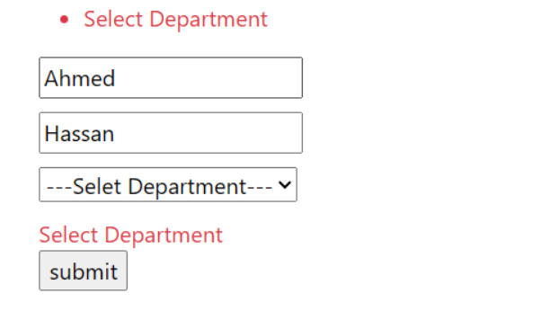

- ==Note That It is Server-Side== 
### **When Should You Use It ?**

1. **Custom Business Logic** – When validation depends on dynamic conditions.
2. **Database or External Checks** – When you need to check the database (e.g., unique email, existing username).
3. **General Errors** – When you want to show an error not related to a specific field.
4. **API Error Handling** – When returning structured validation errors in an API.
----------
#### **2- Making my Own Attribute** (==Server-Side==)

If I want to create a unique attribute for a name, I need to create a new model (class) and name it with 'Attribute' at the end, like `UniqueAttribute`.
``` csharp
public class UniqueAttribute : ValidationAttribute
{
     public string msg { get; set; }//to use it by attribute 

    protected override ValidationResult? IsValid(object? value, ValidationContext validationContext)
    {
        if (value == null)
        {
            return null;
        }
        
        string name = value.ToString();
        
        var context = new ItiContext();
        
        Student student = context.Students.
        FirstOrDefault(b => b.StFname == name);
      
         Student sts =(Student)validationContext.ObjectInstance;
        //To Use the validationContext  
        
        if (student != null)
        {
            return new ValidationResult("Error Message");
        }

        return ValidationResult.Success;
    }
}
```

```csharp

//At the Model
[Unique(msg ="Any Message")]
public string StFname { get; set; }
```

#### **1. `object? value`**

- This is the **value** of the property that the attribute is applied to.
- It contains the data that needs to be validated.
- It can be `null`, so you must check before using it.
- You typically cast it to the expected type (`string`, `int`, etc.).

#### **2. `ValidationContext validationContext`**

- This provides **metadata** about the validation process.
- It contains details about the **object being validated**.
- It is the Object of model that `UniqueAttribute` Called from 
- must make explicit casting to use it 

### Note Again :
- ####  it is Server Side 

----
To enable **custom client-side validation**, we need to **use `jQuery along with jQuery Validation and jQuery Unobtrusive Validation`**.
### **Steps to Set Up Client-Side Validation**

#### **1. Include jQuery and Validation Scripts**

You need to include the required JavaScript libraries at the end of the view:

```csharp
<script src="~/lib/jquery/dist/jquery.min.js"></script>
<script src="~/lib/jquery-validation/dist/jquery.validate.min.js"></script> <script src="~/lib/jquery-validation-unobtrusive/jquery.validate.unobtrusive.min.js"></script>
```
 **Why at the end?**  
Placing scripts at the bottom ensures that the entire page loads first, improving performance.

---

#### **2. Recommended Approach: Use `_Layout.cshtml` for Script Loading**

Instead of adding scripts manually in every view, it's best to load them in the `_Layout.cshtml` file using the built-in **`@RenderSectionAsync("Scripts")`** method.

***Note*** : Can add it by new section at end 

In `_Layout.cshtml` (usually before `</body>`):

`@await RenderSectionAsync("Scripts", required: false)`

This allows each view to **inject its own scripts** inside a `Scripts` section without duplicating code.

Then, in individual views:

```c#
@section Scripts {     
<script src="~/lib/jquery-validation/dist/jquery.validate.min.js"></script> 
<script src="~/lib/jquery-validation-unobtrusive/jquery.validate.unobtrusive.min.js"></script> 
}
```

📌 **Why don’t we include jQuery again?**  
Because `_Layout.cshtml` typically already includes `jquery.min.js`, so we only add validation scripts where needed.

---
#### **3- Making Remote Validation  (Remote)** 
(==Server-Side & Client-Side==)
`[Remote]` is an **attribute** used for **client-side validation** that makes an **AJAX call to the server** to validate a field **without submitting the entire form**.

- at model
```c#
public class UserModel
{
    [Required]
    [Remote(action:"check",controller:"Instructor",ErrorMessage ="MSG")]
    public string Username { get; set; }
}
```

- at controlled
```c#
 public IActionResult check(string Username)
 //name for attribute must be same for property
 {
     if(Username.Contains("Mr"))
     {
         return Json(true);
     }
     return Json(false);
 }
```
#### **Note** : Function's Parameter must be same name for Model's Property

- I Can Put more than property to check ...by  :
At Model
``` c#
public class UserModel
{
    [Required]
     [Remote(action:"check",controller:"Instructor",ErrorMessage ="MSG"
     ,AdditionalFields ="Address,Email"
     )]
    public string Username { get; set; }
    public string Email { get; set; }
    public string Address { get; set; }
}
```

At Controller
```c#
public IActionResult check(string Username ,string Email ,string Address)
 {
     //You Can Check Any of them if there is any relationship between them 
 }
```

---
#### ***Note***: Validation By Remote I Must Call Jquery At View 
---

## Difference Between Remote Validation and Custom Validation in ASP.NET Core

| Feature                        | Remote Validation (`[Remote]`)                              | Custom Validation (`ValidationAttribute`)    |
| ------------------------------ | ----------------------------------------------------------- | -------------------------------------------- |
| **Where It Runs?**             | Client-side (AJAX) + Server                                 | Server-side only                             |
| **Uses AJAX?**                 | ✅ Yes                                                       | ❌ No                                         |
| **Ideal For?**                 | Checking **existing records** (e.g., unique username/email) | Business rules, **complex field validation** |
| **Requires JavaScript?**       | ✅ Yes                                                       | ❌ No                                         |
| **Multiple Field Validation?** | ✅ Yes, with `AdditionalFields`                              | ✅ Yes, using `ValidationContext`             |

### **When to Use What?**
- ✅ **Use Remote Validation (`[Remote]`)** when you need **real-time** checks (like checking if an email is taken).  
- ✅ **Use Custom Validation (`ValidationAttribute`)** when you need **complex logic** or **server-only validation** (e.g., checking password strength).  

---
#                                             **Day 6**
## 1- MiddleWare

- MiddleWares are Methods in Web Application 

-  in .NET Core, when a request arrives at IIS, it forwards the request to the ASP.NET Core runtime Proxy (specifically Kestrel). Kestrel then executes the middleware pipeline configured in the application.

- **Middleware** in ASP.NET Core is a component that is part of the request processing pipeline. It handles:
  
   1- **Incoming requests** (before they reach your controller and after the session being created )
  
   2- **Outgoing responses** (after the controller action is done).
   
   3- Each middleware can:

- 1. **Process the request and is called (short-circuit the pipeline) , not call the next middleware.**
    
2. **Process the request and then invoke the next middleware.**
    
3. **Do nothing and immediately call the next middleware.**

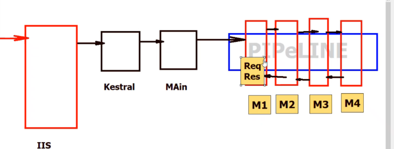

#### Note that :
###### M1 -> M2 -> M3 -> M4 -> M3 -> M2 -> M1 

-  We can build our own middleware by providing a delegate, and there are three types of middleware:

   1. Execute then invoke the next component ⇒ `Use`
    
   2. Execute and terminate the pipeline ⇒ `Run`
    
   3. Branch based on URL and execute a delegate,  .Map(url , Exec) ⇒ `Map`

Example :-

``` csharp
public static void Main(string[] args)
{
    var builder = WebApplication.CreateBuilder(args);

    // Add services to the container.//Day8
    builder.Services.AddControllersWithViews();
    builder.Services.AddSession(options => {
        options.IdleTimeout = TimeSpan.FromMinutes(30);
    });
    
    
    var app = builder.Build();

    #region Custom Middleware "inline Middleware"

    app.Use(async (httpContext, Next) =>
    {
        await httpContext.Response.WriteAsync("1)Middleware 1\n");
        await Next.Invoke();
        await httpContext.Response.WriteAsync("1)Middleware 1--\n");

        //
    });
    app.Use(async (httpContext, Next) =>
    {
        await httpContext.Response.WriteAsync("2)Middleware 2\n");
        await Next.Invoke();
        await httpContext.Response.WriteAsync("2)Middleware 2-----\n");

    });
    app.Run(async (httpContext) =>
    {
        await httpContext.Response.WriteAsync("3)Terminate\n");

    });
    app.Use(async (httpContext, Next) =>
    {
        await httpContext.Response.WriteAsync("4)Middleware 4\n");
        await Next.Invoke();
        //
    });
   
    app.Run();
}

```

Output : 
``` lua
1)Middleware 1
2)Middleware 2
3)Terminate
2)Middleware 2-----
1)Middleware 1--
```


1-` var app = builder.Build();
     from here start using my Web Application Object 
2- We use `app.Run`  last of all MiddleWares 
3- We uses Lambda for Delegate but You can make Your own Function 
4- Function `Next.Invoke()` is Async so we use `await` and mark the delegate as `async` to ensure the middleware completes before moving on.

- ###  Bulit in MiddleWare
   ``` csharp
public static void Main(string[] args)
{
    var builder = WebApplication.CreateBuilder(args);

    // Add services to the container.
    builder.Services.AddControllersWithViews();

    var app = builder.Build();

    // Configure the HTTP request pipeline.


    #region main middleware
    
    if (!app.Environment.IsDevelopment())
    {
        app.UseExceptionHandler("/Home/Error");
    }
    app.UseStaticFiles(); // for jquery and bootstrap

    app.UseRouting();// put for Routering

    app.UseAuthorization(); // for Authorization , 

    app.MapControllerRoute(
        name: "default",
        pattern: "{controller=Home}/{action=Index}/{id?}");
    #endregion

    app.Run();
}
     ```

### Note : 
``` csharp
if (!app.Environment.IsDevelopment())
    {
        app.UseExceptionHandler("/Home/Error");
    }
```

it used For end-user not Developer that make it easy for him to explore Errors and exceptions 

- once You need to make Authentication :
    make  Authenticate before you authorize
    
 ``` csharp
app.UseAuthentication();// ← INSERT THIS 
// 4) Authenticate before you authorize
app.UseAuthorization();
```

| Aspect            | Authentication                                          | Authorization                                             |
| ----------------- | ------------------------------------------------------- | --------------------------------------------------------- |
| Purpose           | Establish **who** you are                               | Determine **what** you can do (your permission )          |
| Question answered | “Are you who you claim to be?”                          | “Are you allowed to perform this action?”                 |
| Common methods    | Username/password, tokens (JWT), API keys, certificates | Roles, policies, scopes, resource‐based permission checks |

- <a href="https://learn.microsoft.com/en-us/aspnet/core/fundamentals/middleware/?view=aspnetcore-9.0" target="_blank">Click For most popular built-in MiddleWares </a> 
-----------
## 2- StateManagment
 
 - Explained At  [Day 2](#statemanagement) (Page 6 )

 
--------------
##                                          Day 7 

**the best practice in software architecture (especially in C# and ASP.NET environments)** is to follow this flow:
###  **Model → Repository → Controller**

This layered approach promotes separation of concerns, maintainability, and testability. Here's what each layer is responsible for:

Note: 
  A **Repository** is a class (or interface + class) that:

- Encapsulates the logic required to **access data sources** (e.g., SQL Server, MongoDB, APIs).
    
- Provides **CRUD (Create , Read , Update , Delete ) operations** for a specific model.
    
- Hides all the low-level database details from the rest of the app

this approach is called <span style ="color:gold">Repository Pattern</span> we try not to write code at controller

So : 
 **Controller** interacts with the **Repository**, and the **Repository** interacts with the **Database Context** (often referred to as the **DbContext** in Entity Framework for C#).
#  SOLID Principles in C# 
##  1. Single Responsibility Principle (SRP)

###  What It Means:

> A class should have only one reason to change.  

Each class should focus on a single task/responsibility, which improves **maintainability**, **testability**, and **readability**.

---
### ❌ Violates SRP

```csharp

public class UserManager
{

    public void AddUser(string username)
    {

        // Add user logic

    }

    public void SendNotification(string message)
    {

        // Send notification logic

    }
}

```

### ✅ Applies SRP

```csharp

public class UserManager
{

    private readonly IUserRepository _userRepository;

    public UserManager(IUserRepository userRepository)
    {

        _userRepository = userRepository;

    }

  

    public void AddUser(string username)
    {

        // Add user logic

    }

}

  

public class NotificationService
{

    public void SendNotification(string message)

    {

        // Send notification logic

    }

}

```

  
> 🔧 Now, each class has **one responsibility** only:  

`UserManager` manages users, `NotificationService` sends notifications.

---
##  2. Open/Closed Principle (OCP)

- ### What It Means:

> A class should be **open for extension**, but **closed for modification**.  

We should be able to add new functionality without changing existing code.

  

---
### ❌ Violates OCP

```csharp

public class PaymentProcessor
{

    public void ProcessPayment(string type)
    {

        if (type == "CreditCard")
        {

            // CreditCard logic

        }

        else if (type == "PayPal")
        {

            // PayPal logic

        }

    }

}

```

###  Applies OCP

```csharp

public interface IPaymentMethod
{

    void ProcessPayment(decimal amount);

}

  
public class CreditCardPayment : IPaymentMethod
{

    public void ProcessPayment(decimal amount)

    {

        // CreditCard logic

    }

}


public class PayPalPayment : IPaymentMethod
{
    public void ProcessPayment(decimal amount)

    {

        // PayPal logic

    }
}
  

public class PaymentProcessor
{

    public void ProcessPayment(IPaymentMethod paymentMethod, decimal amount)
    // pass credit or paypal obj  
    {

        paymentMethod.ProcessPayment(amount);

    }

}

```

  

> 🔧 Add new payment types **without modifying** `PaymentProcessor`.

  

---
##  3. Liskov Substitution Principle (LSP)
###  What It Means:

> Subclasses must be replaceable for their base classes **without breaking functionality**.  

Ensure subclasses behave correctly when used in place of their parent class.

---
###  Violates LSP

```csharp

public class Bird
{

    public virtual void Fly()

    {

        // Flying logic

    }

}

public class Ostrich : Bird
{

    public override void Fly()

    {

        throw new NotImplementedException(); // Ostriches can't fly

    }

}

```
##  Applies LSP

```csharp

public abstract class Bird
{

    public abstract void Move();

}

public class Sparrow : Bird
{

    public override void Move()
    {

        // Flying logic

    }

}


public class Ostrich : Bird
{

    public override void Move()
    {

        // Running logic

    }
}
```

  

> 🔧 All subclasses can now be used **interchangeably** via `Move()` without causing errors.

  

---
##  4. Interface Segregation Principle (ISP)
###  What It Means:

> Clients should not be forced to depend on interfaces they **don’t use**.  

Split large interfaces into **smaller, role-specific ones**.

---
### ❌ Violates ISP

```csharp

public interface IWorker
{

    void Work();

    void Eat(); // Not needed for Robot

}

  

public class Robot : IWorker
{

    public void Work() { /* Work logic */ }

    public void Eat()
    {

        throw new NotImplementedException(); // Robots don't eat

    }

}
```
### ✅ Applies ISP

```csharp

public interface IWorkable
{

    void Work();

}

  

public interface IFeedable
{

    void Eat();

}

  

public class Robot : IWorkable
{

    public void Work() { /* Work logic */ }

}

  

public class Human : IWorkable, IFeedable
{

    public void Work() { /* Work logic */ }

    public void Eat() { /* Eat logic */ }

}

```

  

> 🔧 Each class **implements only what it needs**, reducing bloated interfaces.

---
##  5. Dependency Inversion Principle (DIP)
###  What It Means:

> High-level modules should not depend on low-level modules.  

> Both should depend on **abstractions**.
---
### ❌ Violates DIP

```csharp

public class PaymentProcessor
{
    private readonly CreditCardPayment _payment = new CreditCardPayment();

    public void ProcessPayment(decimal amount)
    {
        _payment.Process(amount);
    }

}

public class CreditCardPayment
{
    public void Process(decimal amount)
    {
        // Payment logic
    }
}

```
###  Applies DIP

```csharp

public interface IPaymentMethod
{

    void Process(decimal amount);

}

public class CreditCardPayment : IPaymentMethod
{
    public void Process(decimal amount)
    {

        // Payment logic
    }
}

public class PaymentProcessor
{
    private readonly IPaymentMethod _paymentMethod;

    public PaymentProcessor(IPaymentMethod paymentMethod)
    {
        _paymentMethod = paymentMethod;
    }
    public void ProcessPayment(decimal amount)

    {
        _paymentMethod.Process(amount);
    }
}

```

> 🔧 The `PaymentProcessor` depends on **abstraction**, not on concrete classes. Easier to switch implementations (e.g., to PayPal or Crypto).

<a href="https://www.linkedin.com/posts/ahmed-elghrabawy_what-is-dependency-injection-in-net-activity-7278411902983000065-2CCp?utm_source=share&utm_medium=member_android&rcm=ACoAAD7r_gIBuWxSSJqAEeiHbd7WSxStnQ72ivk">Strongly Recommended To Read About Dependency Injection</a>

---
##  Final Summary

| Principle | Full Name             | Key Idea                                                |
| --------- | --------------------- | ------------------------------------------------------- |
| **S**     | Single Responsibility | One job per class                                       |
| **O**     | Open/Closed           | Extend behavior without modifying code                  |
| **L**     | Liskov Substitution   | Subclasses should fully work in place of parents        |
| **I**     | Interface Segregation | Avoid forcing classes to implement what they don’t need |
| **D**     | Dependency Inversion  | Rely on abstractions, not concrete implementations      |

- Suppose we have two models to implement: Employee and Department.  
We have three folders:

1. Repository (contains interfaces and repository classes),
    
2. Model (contains the actual models),
    
3. Controllers (contains the controllers for the models).  
    Remember, we try not to write model logic inside the controllers.


  example on Employee Method :
  1- Employee Model
``` csharp
public class Employee
{
    public int Id { get; set; }

    //        [Required]
    [MinLength(2,ErrorMessage ="Name Must be greater than 2 char")]
    [MaxLength(25)]
    [Unique]
    public string Name { get; set; }

    //[Range(6000,25000,ErrorMessage ="Salary mustbe range 6000 to 25000")]
    [Remote("CheckSalary","Employee"
        ,AdditionalFields = "JobTitle"
        , ErrorMessage ="Salary greater than 6000 L.E")]
    public int Salary { get; set; }

    public string JobTitle { get; set; }

    [RegularExpression(@"\w+\.(jpg|png)",ErrorMessage ="Image must Be jpg or png")]
    public string ImageURL { get; set; }


    public string? Address { get; set; }
   
    [ForeignKey("Department")]
    [Display(Name="Department")]
    public int DepartmentID { get; set; }

    public Department? Department { get; set; }
}
```

2- Employee Repository:
- Employee Interface 
``` csharp
 public interface IEmployeeRepository
 {
     public void Add(Employee obj);

     public void Update(Employee obj);

     public void Delete(int id);

     public List<Employee> GetAll();
     public Employee GetById(int id);

     public void Save();
   
 }
```

- Employee Repository
 ``` csharp
public class EmployeeRepository:IEmployeeRepository
{
    ITIContext context;
    public EmployeeRepository()
    {
        context = new ITIContext();
    }
    //CRUD
    public void Add(Employee obj)
    {
        context.Add(obj);
    }
    public void Update(Employee obj)
    {
        context.Update(obj);

    }

    public void Delete(int id)
    {
        Employee Emp = GetById(id);
        context.Remove(Emp);
    }
    public List<Employee> GetAll()
    {
        return context.Employee.ToList();
    }
    public Employee GetById(int id)
    {
        return context.Employee.FirstOrDefault(e => e.Id == id);
    }
    public void Save()
    {
        context.SaveChanges();
    }
}
 ```

3- Employee Controller (inject By Constructor): 
``` csharp
 public class EmployeeController : Controller
 {
     //  ITIContext context = new ITIContext();
     IEmployeeRepository EmployeeRepository;
     public EmployeeController(IEmployeeRepository EmpRepo)
     {
         EmployeeRepository = EmpRepo;
     }
 }

   // Actions to implement 

```

- After this implementation we have a problem that the Controller Factory can't create an instance of EmployeeRepository to pass it as a parameter to the controller constructor because :
 
     - The `EmployeeController` needs an `IEmployeeRepository` passed **into** its constructor.
       
    - But ASP.NET MVC **by default** does not know _how to create_ an `IEmployeeRepository`.
    
    - So the **Controller Factory** (the part that creates controllers) **throws an error** because it can't build `EmployeeController` automatically
    
--- 

- To Fix the exception we implement `IoC` Container (**`Inversion of Control`**). 
   : Instead of a class creating its own dependencies, someone else (usually a framework or container) injects those dependencies into the class or creating the needed objects?

- in .net IoC Called Service Provider , how IoC containers work : 
    - We usually deal with **three key operations**:

| Term         | Meaning (Simple)                                                                                                 | Example                                                                          |
| ------------ | ---------------------------------------------------------------------------------------------------------------- | -------------------------------------------------------------------------------- |
| **Register** | Tell the IoC container _which classes_ to create when asked for an interface.                                    | `builder.Services.AddScoped<IEmployeeRepository, EmployeeRepository>();`         |
| **Resolve**  | Ask the IoC container _to give you an instance_ of a registered service. (Happens automatically in Controllers.) | Controller constructor parameter: `EmployeeController(IEmployeeRepository repo)` |
| **Dispose**  | Free or clean up objects _after they finish_. This happens automatically if you use DI properly.                 | The container disposes your repository instance after the request ends.          |
|              |                                                                                                                  |                                                                                  |

- ##  quick summary:

| Step         | Action                                                         |
| ------------ | -------------------------------------------------------------- |
| **Register** | Add service to the container.                                  |
| **Resolve**  | Get an instance when needed (e.g., in controller constructor). |
| **Dispose**  | Automatically clean up the service after use.                  |

---
<H3 style="  text-align: center">Services Type</H3> 
-  There are basically two types of services in ASP.NET Core

| Type                   | Declared         | Registered                  | Example                                                      |
| ---------------------- | ---------------- | --------------------------- | ------------------------------------------------------------ |
| **Framework Services** | Already declared | Already registered          | `ILogger<T>`, `IHttpContextAccessor`                         |
| **Built-in Services**  | Already declared | Must be registered manually | `AddDbContext<>`, `AddAuthentication()`                      |
| Custom Services        | Not declared     | Not Registered              | `AddTransient<>()` <br>`AddScoped<>()`<br>`AddSingleton<>()` |


- ## 1- Register

- it's Called by the host before the Configure method to configure the app's services

``` csharp
   public static void Main(string[] args)
   {
       var builder = WebApplication.CreateBuilder(args);
       //Framwork service :already decalre ,alraedy register
       //built in service :already delcare ,need to register
       // Add services to the container.
       builder.Services.AddControllersWithViews();
       //Custom Servce "RegisterB
       builder.Services.AddScoped<IEmployeeRepository, EmployeeRepository>(); 
       
       var app = builder.Build();

       app.Run();
   }
     
```

``` csharp
 builder.Services.AddScoped<IEmployeeRepository, EmployeeRepository>(); 
```
You're telling the ASP.NET Core **Dependency Injection (DI) container** that when a class (like a controller) **requests** an instance of `IEmployeeRepository`, the container should create (resolve) an instance of `EmployeeRepository`.

- ###  Life-Time of Custom Service :

| Lifetime                            | Behavior                                                                  |
| ----------------------------------- | ------------------------------------------------------------------------- |
| `builder.Services.AddTransient<>()` |  New object is created **every time** it’s requested/injected.            |
| `builder.Services.AddScoped<>()`    | One object **per HTTP request** (or per created scope).                   |
| `builder.Services.AddSingleton<>()` | One object for the **whole application lifetime** (same instance always). |

---
- ## 2- Resolve (at controller)
1- inject (ask) by ***constructor*** :
``` csharp
 public EmployeeController(IEmployeeRepository EmpRepo)
 {
     EmployeeRepository = EmpRepo;
 }
```
- In this constructor, ASP.NET Core uses dependency injection to automatically provide an instance of `IEmployeeRepository` when creating the `EmployeeController`, as long as the service is properly registered in the DI container.

2- inject by ***Action***

``` csharp
public IActionResult Details([FromServices] IEmployeeRepository employeeRepository)
    {
        var employee = employeeRepository.GetById(id);
        return View(employee);
    }
```
- When you use **Action Injection** in a controller, the **[FromServices]** attribute tells the Dependency Injection (DI) system to **inject the service directly into the action parameter**, ignoring any model binding that might otherwise be used.
- examples :
    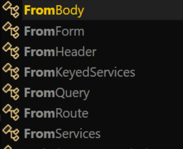

 
| Attribute               | Where the value comes from                  | Example                                            |
| ----------------------- | ------------------------------------------- | -------------------------------------------------- |
| **[FromBody]**          | Request body (usually JSON) (API)           | `POST` data (like a JSON object)                   |
| **[FromForm]**          | Form fields (like HTML forms)               | `<form method="post">`                             |
| **[FromHeader]**        | HTTP request headers                        | e.g., `Authorization` header                       |
| **[FromKeyedServices]** | From DI container **by key**                | Special keyed services in DI (advanced use)        |
| **[FromQuery]**         | URL query string parameters                 | `/api/items?id=5`                                  |
| **[FromRoute]**         | URL route parameters                        | `/api/items/5` (id from route)                     |
| **[FromServices]**      | From the **dependency injection container** | Inject a service like a logger or business service |

## 3 - Inject by _**View**_

### _**Note:**_

- Before we talk about injecting services into a view, we can make the `Repository` folder easier to access everywhere by creating a **global using**.
    
- To do this, add the following line (for example, in a `GlobalUsings.cs` file):
    

``` csharp 
global using MVC.Repository;
```

- This way, you don't need to manually add `using MVC.Repository;` in every file — it becomes automatically available across the whole project.

- ### How to Inject a Service in a View

 - Use the `@inject` directive at the top of your `.cshtml` view.
``` csharp
@inject IDepartmentRepository deptREpo
@{
    ViewData["Title"] = "Index";
}
<h1>Index</h1>
<h3>Id From View @deptREpo.Id</h3>
```

- ### Note: 
    `Id = Guid.NewGuid().ToString();`  it returns unique id every time You call it .
-----
- If You remember at employee repository :
``` csharp
public EmployeeRepository()
    {
        context = new ITIContext();
    }
```
- the `context = new ITIContext();` inside the constructor of `EmployeeRepository` violates the Dependency Injection (DI) principle. In a Dependency Injection pattern, dependencies (like the `ITIContext`) should be provided externally, rather than being created inside the class. This allows for easier testing, better flexibility, and separation of concerns.

- In this case, you should inject the `ITIContext` into the constructor of `EmployeeRepository` instead of creating it directly in the constructor by: 


- 1 -  We're using `appsettings.json` to store the connection string, which is a great approach to avoid hardcoding sensitive information like database credentials. The configuration in `appsettings.json` should look like this:

``` json
{
  "Logging": {
    "LogLevel": {
      "Default": "Information",
      "Microsoft.AspNetCore": "Warning"
    }
  },
  "AllowedHosts": "*",
  "ConnectionStrings": {
    "cs": "Data Source=.;Initial Catalog=ITI;Integrated Security=True;Encrypt=False;Trust Server Certificate=True"
  }
}
```

2- adding a constructor to our `ITIContext` class that accepts `DbContextOptions` is required to use the configuration provided through the `appsettings.json` file. The goal here is to pass the configuration (e.g., connection string) to the `DbContext` via the `DbContextOptions`:

``` csharp
public class ITIContext : DbContext
{
    public ITIContext(DbContextOptions<ITIContext> options) : base(options){}
    // DbSets, etc.
}

```
  - This constructor ensures that `ITIContext` can be configured using the `DbContextOptions` that will be set up via the DI container.


 3- In your `Program.cs` or `Startup.cs` (depending on your ASP.NET Core version), you're registering `ITIContext` in the DI container. The `UseSqlServer` method will use the connection string from `appsettings.json`:

``` csharp
public class Program
{
    public static void Main(string[] args)
    {
        var builder = WebApplication.CreateBuilder(args);

        // Add DbContext to the DI container with the connection string
        builder.Services.AddDbContext<ITIContext>(options =>
        {
    options.UseSqlServer(builder.Configuration.GetConnectionString("cs"));
        });

        // Other services...

        var app = builder.Build();

        // Other middleware...
    }
}

```


4- our `EmployeeRepository` now has the `ITIContext` injected via its constructor:

``` csharp
public class EmployeeRepository
{
    private readonly ITIContext _context;
    public EmployeeRepository(ITIContext context)
    {
        _context = context;
    }
}
```
### Key Points:

- **Appsettings.json**: The connection string is pulled from the configuration, so no hardcoding is needed.
    
- **DbContext Constructor**: The `ITIContext` constructor is modified to accept `DbContextOptions`.
    
- **DI Registration**: In `Program.cs` or `Startup.cs`, `ITIContext` is registered with the DI container using `AddDbContext`.
    
- **Repository Constructor**: `EmployeeRepository` accepts `ITIContext` via constructor injection.

### ***Note*** :
- The method `builder.Services.AddDbContext<ITIContext>(options => { ... })` registers the `DbContext` (in this case `ITIContext`) in the **Dependency Injection (DI)** container. Once you register the `DbContext`, it can be injected into any service or class that requires it.

- `AddDbContext` registers the `DbContext` to be injected into classes that depend on it. In other words, you cannot directly use `ITIContext` unless the class is being injected via **Dependency Injection**.

-  in custom validation, use the **default constructor** (`public ITIContext() : base()`), and you don't use DI to inject the context, it will work properly but it violates DI 
---
#                                   Day 8

##  1 - Filters 
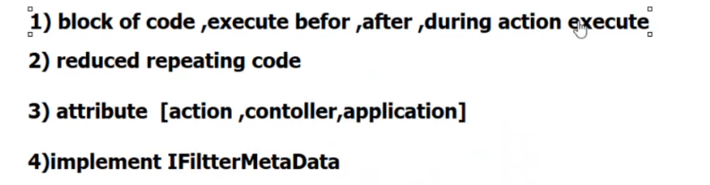

  -  1️- **A filter is a block of code that executes before, after, or around the execution of an action method, result, or other parts of the request pipeline.**

 - 2️- **Filters are used to reduce repetitive code by handling cross-cutting concerns such as logging, caching, authorization, or error handling in a centralized way.**

 - 3️- **Filters can be applied at different scopes: on an action method, on a controller class, or globally at the application level through configuration.**

 - 4️- **At a low level, a custom filter implements specific filter interfaces such as `IActionFilter`, `IResultFilter`, `IExceptionFilter`, or their async counterparts. All these interfaces inherit from the `IFilterMetadata` marker interface, which provides metadata about the filter but is not typically implemented directly.**


***Note*** :  <span style="color:gold">Filters</span> is at <span style="color:gold"> MVC</span> Level,  Unlike  <span style="color:gold">MiddleWares </span>is that At <span style="color:gold">Application Level</span>

***Built-in Filters*** :
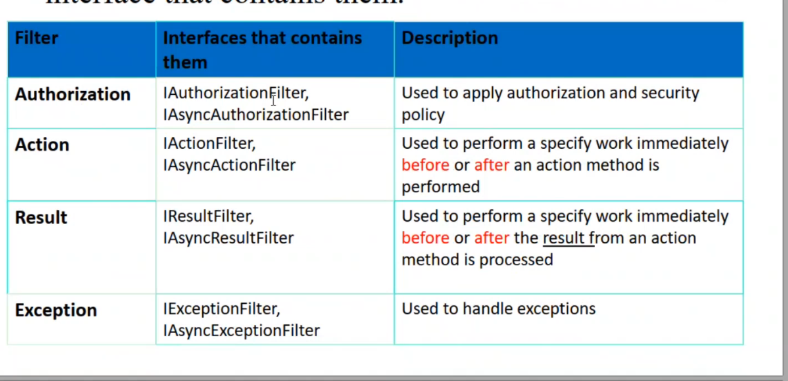


##  1️-  **Authorization Filters**

**What they do:**  
Run _before everything else_ to determine if the current user/request is allowed to continue.

**Built-in example:**

- `[Authorize]` attribute.
    
- `[AllowAnonymous]` to skip authorization or Enter As anonymous
    
**Example :**

``` csharp
[Authorize] 
public class SecureController : Controller 
{     public IActionResult Secret()  
      {         return View();     
      }
}
```

---
## 2- **Action Filter**
The **action filter** is one of the most **common ways to build your own custom filter** in ASP.NET Core.

When you want to create a filter that **runs code before and/or after your action method**, you typically implement:

- `IActionFilter` (for synchronous code)
    
- or `IAsyncActionFilter` (for async code)
    

This allows you to **inject custom behavior** around the **action method execution.**

## Why would We use an Action Filter?

 To **reduce repetitive code** by handling things like:

- Logging
    
- Validation
    
- Modifying input/output
    
- Measuring execution time
    
- Adding headers, etc.
    

Instead of repeating this logic in every action, you **write it once in a filter.**

***Example :***
``` csharp
public class LogActionFilter : Attribute, IActionFilter
{
    public void OnActionExecuting(ActionExecutingContext context)
    {
        Console.WriteLine($"[Before] {context.ActionDescriptor.DisplayName}");
    }

    public void OnActionExecuted(ActionExecutedContext context)
    {
        Console.WriteLine($"[After] {context.ActionDescriptor.DisplayName}");
    }
}

```


## **1️- `OnActionExecuting`**

### **What it does:**

- **Runs before the action method is executed.**
    
- This is where you can add custom logic **before the action runs** (e.g., validation, logging, modifying parameters, or even redirecting).
    
### **Parameters:**

- **`ActionExecutingContext` context**: This object provides information about the action being executed, such as:
    
    - The **action descriptor** (details about the action method).
        
    - The **action parameters** (input data passed to the action).
        

### **Typical Use Cases:**

- **Validation**: Check if the data passed into the action is valid.
    
- **Logging**: Log the start of the action execution.
    
- **Authorization checks**: Ensure the user has the right permissions.
    
- **Modify input data**: Manipulate action arguments before the action runs.

## **2️ `OnActionExecuted`**

### **What it does:**

- **Runs after the action method has executed,** but **before the result is executed** (i.e., before the action's return value is processed by any result filters or sent back to the client).
    
- This is where you can perform **post-action processing** (e.g., logging the result, modifying the result, error handling).
    

### **Parameters:**

- **`ActionExecutedContext` context**: This object provides information about the executed action:
    
    - The **action descriptor** (details about the executed action).
        
    - The **action result** (the result returned by the action, such as `ViewResult`, `JsonResult`, etc.).
        

### **Typical Use Cases:**

- **Logging**: Log the completion of the action execution.
    
- **Error handling**: Handle or log any errors that occurred during the action execution.
    
- **Modifying the action result**: Change the result returned by the action before it is processed further.

***Note :***
- if Used one method of them, don't make the other throw an Exception 
---
## 3️- **Result Filters**

**What they do:**  
Run _before and after_ the **result** (e.g., a View or JSON response) is processed. Used to change the result or log view rendering.

**Built-in example:**  
No common standalone result filters, but `ResponseCache` acts partly at this level.

***Example:***
At Home Controller :
-  It controls **caching behavior** of the HTTP response by setting appropriate **cache-related headers.**

``` csharp
 [ResponseCache(Duration = 0, Location = ResponseCacheLocation.None, NoStore = true)]
 public IActionResult Error()
 {
     return View(new ErrorViewModel { RequestId = Activity.Current?.Id ?? HttpContext.TraceIdentifier });
 }
```

-----
## 4️- **Exception Filter**

**Job:**

- Runs when an **unhandled exception** is thrown in the action or result execution.
    
- Used to **log, transform, or handle exceptions gracefully.**
    

**Built-in idea:**  
ASP.NET Core recommends middleware for global error handling now, but in MVC filters:

- `[HandleError]` (classic MVC) or exception filters registered in Core.

***Example :***
``` csharp
public class MyExceptionFilterAttribute : Attribute, IExceptionFilter
{
    public void OnException(ExceptionContext context)
    {
        Console.WriteLine("Exception caught: " + context.Exception.Message);
        context.Result = new ContentResult
        {
            Content = "An error occurred, but it was handled by a filter."
        };
        context.ExceptionHandled = true; // prevents the exception from propagating
    }
}
```

Another Example :
``` csharp
 public class ErrorClassAttribute : Attribute, IExceptionFilter
 {
     public void OnException(ExceptionContext context)
     {
         string msg =context.Exception.Message+ " excep";
         var viewResult = new ViewResult
         {
             ViewName = "Error",
             ViewData = new ViewDataDictionary(new EmptyModelMetadataProvider(), new ModelStateDictionary())
         };

         viewResult.ViewData["msg"] = msg;
         context.Result = viewResult;

     }
 }
```
 
 - We must Inherit First from Attribute class then IExceptionFilter interface , to use it as attribute 

At Controller: 

``` csharp
[ErrorClass]
public IActionResult TestError()
{
    throw new Exception("Test exception");
}

```

**Note :*** 
` ViewName = "Error"` means using Error View that is at Shred File

To use Filter for all actions at different Controllers (For Application ):

At Program.cs
``` csharp
 builder.Services.AddControllersWithViews(option =>
 {
     option.Filters.Add(new MyExceptionFilter());
 });
```


---
###  Think of it like this:
| Step | Happens when...                 | Example                                    | Filter Type(s)                                                  |
| ---- | ------------------------------- | ------------------------------------------ | --------------------------------------------------------------- |
| 1️⃣  | Before action logic             | Logging, authorization, model manipulation | `OnActionExecuting` (in `IActionFilter` / `IAsyncActionFilter`) |
| 2️⃣  | After action method returns     | Modify returned data or check exceptions   | `OnActionExecuted` (in `IActionFilter` / `IAsyncActionFilter`)  |
| 3️⃣  | Before View rendering           | Change ViewData, swap ViewName, log info   | `OnResultExecuting` (in `IResultFilter` / `IAsyncResultFilter`) |
| 4️⃣  | After View is rendered and sent | Cleanup, log completion, post-processing   | `OnResultExecuted` (in `IResultFilter` / `IAsyncResultFilter`)  |

---
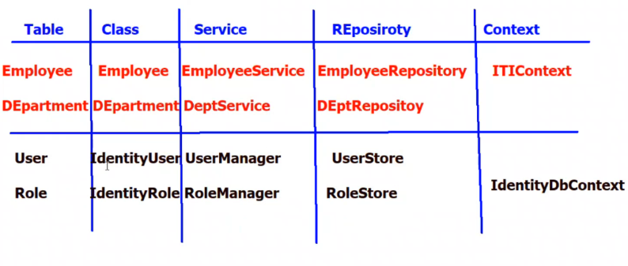

- Sometimes We need to add layer between Repository and model called Service to make mapping 

- **We Need To Know What Are Identity Classes?** 
     In **ASP.NET Core Identity**, Microsoft provides a set of **built-in classes** that help you **manage authentication and authorization** out of the box.


The **core classes** are:

| Class                  | Purpose                                                                                                                                                                                                               |
| ---------------------- | --------------------------------------------------------------------------------------------------------------------------------------------------------------------------------------------------------------------- |
| `IdentityUser`         | Represents a **user account** (e.g., a person who logs in).                                                                                                                                                           |
| `IdentityRole`         | Represents a **role** (e.g., Admin, User, Manager).                                                                                                                                                                   |
| `IdentityDbContext`    | The Entity Framework **DbContext** that contains the tables to store users, roles, etc.                                                                                                                               |
| `UserManager<TUser>`   | A service to **create, update, delete, and manage users.**                                                                                                                                                            |
| `RoleManager<TRole>`   | A service to **create, update, delete, and manage roles.**                                                                                                                                                            |
| `SignInManager<TUser>` | Handles **<span style="color:gold">login, logout, and authentication logic</span> &&  <span style="color:gold">Stores the user's claims in the <span style="color:green">cookie </span> for future requests.</span>** |
| `UserStore<TUser>`     | Implements `IUserStore` and works with EF Core to save users in DB.                                                                                                                                                   |
| `RoleStore<TRole>`<br> | Implements `IRoleStore` and works with EF Core to save roles in DB.                                                                                                                                                   |
 then :
**UserManager**--(deals with)-->**UserStore**--(deals with)-->**IdentityDBContext**


IdentityUser has :
``` csharp
public class IdentityUser
{
    public string Id { get; set; }                      // Unique user ID (usually a GUID)
    public string UserName { get; set; }                // The user's login name
    public string NormalizedUserName { get; set; }      // Normalized version of UserName
    public string Email { get; set; }                   // The user's email address
    public string NormalizedEmail { get; set; }         // Normalized version of Email
    public bool EmailConfirmed { get; set; }            // True if email is confirmed

    public string PasswordHash { get; set; }            // Hashed password
    public string SecurityStamp { get; set; }           // Used to invalidate sessions
    public string ConcurrencyStamp { get; set; }        // For optimistic concurrency checks

    public string PhoneNumber { get; set; }             // User's phone number
    public bool PhoneNumberConfirmed { get; set; }      // True if phone number is confirmed

    public bool TwoFactorEnabled { get; set; }          // Is 2FA enabled
    public DateTimeOffset? LockoutEnd { get; set; }     // Lockout expiration date
    public bool LockoutEnabled { get; set; }            // Can the user be locked out
    public int AccessFailedCount { get; set; }          // Number of failed access attempts
}

```

- In `IdentityUser`, the **`Id`** property is **inherited directly** from the base class and is used as the **primary key** for each user in the database.

### Where is `Id` Defined?

It's defined like this:

``` csharp
public class IdentityUser<TKey> where TKey : IEquatable<TKey>
{
    public virtual TKey Id { get; set; }
    ...
}
```

- When you use the non-generic version `IdentityUser` (i.e., `IdentityUser` without `<TKey>`), it **defaults to `string`**:
``` csharp
public class IdentityUser : IdentityUser<string>
{
    public IdentityUser()
    {
    Id = Guid.NewGuid().ToString();
    SecurityStamp = Guid.NewGuid().ToString();
    }
}
```

### **Extending IdentityUser (Adding Your Own Attributes):**

If you need extra **custom fields** (e.g., FullName, DateOfBirth), you can **inherit** from `IdentityUser` and Make a New Class to follow `Open for Extend Close for Modification ` :

``` csharp
public class ApplicationUser : IdentityUser
{
    public string FullName { get; set; }
    public DateTime DateOfBirth { get; set; }
}

```

- Now We Have 2 Data bases :
       1 - IdentityDbContext
       2- Ower Default Data base (ITIContext) 
  To Solve it We make ITIContext Inherit From IdentityDbContext
- 
``` csharp
 public class ITIContext:IdentityDbContext<ApplicationUser>
 {
     public DbSet<Employee> Employee { get; set; }
     public DbSet<Department> Department { get; set; }
     //
     public ITIContext() : base()
     {
     }

     public ITIContext(DbContextOptions options) : base(options)
     {

     }
     // Required
     protected override void OnModelCreating(ModelBuilder modelBuilder)
     {
        base.OnModelCreating(modelBuilder); 
     }
  }

```

- We Make it Generic to Apply New Attributes  (Attribute For Generic Must inherit from identityDbContext )

- After that we add migration and add update the database 

- ***Now*** We Finished Our Classes and DataBase 
---------------
###  We will make the Controller and ViewModel for mapping , because we don't need to enter all IdentityUser properties


- ## 1- ViewModel:
``` csharp
public class RegisterUserViewModel
{
    public string UserName { get; set; }
    
    [DataType(DataType.Password)]
    public string Password { get; set; }
    
    [Compare("Password")]
    [Display(Name ="Confirm Password")]
    [DataType(DataType.Password)]
    public string ConfirmPassword { get; set; }
    
    public string Address { get; set; }
}
```

- Used For Mapping from View's Data (Request)

 - ## 2-  Controller :
``` csharp
 public class AccountController : Controller
 {
     private readonly UserManager<ApplicationUser> userManager;
     private readonly SignInManager<ApplicationUser> signInManager;

     public AccountController
         (UserManager<ApplicationUser> userManager,SignInManager<ApplicationUser> signInManager)
     {
         this.userManager = userManager;
         this.signInManager = signInManager;
     }

     [HttpPost]
     public async Task<IActionResult> SaveRegister
        (RegisterUserViewModel UserViewModel)
     {
         if (ModelState.IsValid)
         {
             //Mapping
             ApplicationUser appUser = new ApplicationUser();
             appUser.Address = UserViewModel.Address;
             appUser.UserName = UserViewModel.UserName;

             //save database
             IdentityResult result =
                 await userManager.CreateAsync(appUser, UserViewModel.Password);
             if (result.Succeeded)
             {
                 //Cookie
                 await signInManager.SignInAsync(appUser, false);
                 return RedirectToAction("Index");
             }
             foreach (var item in result.Errors)
             {
                 ModelState.AddModelError("", item.Description);
             }
         }
         return View("Register", UserViewModel);
     }
}
```

- Both are injected via Dependency Injection (IoC container) and are ready to use in your controllers or services.
 ``` csharp
 private readonly UserManager<ApplicationUser> userManager;
 private readonly SignInManager<ApplicationUser> signInManager;
 ```
Remember : 
UserManager Used For CRUD operations , SignInManager for adding Cookies 

``` csharp
IdentityResult result = await userManager.CreateAsync(appUser, UserViewModel.Password);
```

- `CreateAsync`:
    
    - Adds the user to the **database**.
        
    - Automatically **hashes the password** and saves it securely.
    
	- returns `IdentityResult` that is a **result object** that tells you **whether the operation succeeded or failed.**
	
	- - When you pass the password to `CreateAsync()`, **it hashes it immediately** using a secure algorithm (by default, PBKDF2 with HMAC-SHA256).
    
    - The result (the **hash**) is saved in the `PasswordHash` column in the `AspNetUsers` table.

    -   It has two key members:

| Property    | Purpose                                                                                     |
| ----------- | ------------------------------------------------------------------------------------------- |
| `Succeeded` | A **bool**: `true` if the user was created successfully; `false` if there were any errors.  |
| `Errors`    | A collection of **IdentityError** objects that explain **what went wrong** (if any errors). |

- `result` tells you if it **succeeded or failed.**
    - Here We Add the Errors to ModelErrors 
    
``` csharp
 foreach (var item in result.Errors)
   {
      ModelState.AddModelError("", item.Description);
   }     
```

***Note :*** Because of CreateAsync is Async We Add ***await*** and Convert ***Action To Task** 

- `SignInAsync`

``` csharp
await signInManager.SignInAsync(appUser, false);
```

   - Sign in the user (`appUser`) and create an authentication cookie to keep them logged in.

|Part|Meaning|
|---|---|
|`appUser`|The user object (of type `ApplicationUser`) you just created or fetched.|
|`false`|This is `isPersistent`: it tells whether the **login session (cookie) should be persistent.**| 

### 3- At Program.cs
``` csharp
 builder.Services.AddIdentity<ApplicationUser, IdentityRole>().AddEntityFrameworkStores<ITIContext>();
```
-  this line **adds Identity services** with your user (`ApplicationUser`) and role (`IdentityRole`).
    
- It also **registers UserManager, SignInManager, RoleManager, etc.** for **Dependency Injection** automatically.
## **What Does It Mean?**

This code **registers ASP.NET Core Identity** in the **dependency injection (DI) container** and tells it:

1️⃣ **Which classes to use for Users and Roles.**

2️⃣ **Which database context to use for storing Identity data.**

---
##  **Breaking Down Each Part:**

|Part|Meaning|
|---|---|
|`AddIdentity<ApplicationUser, IdentityRole>()`|🔧 You're telling ASP.NET:|
||- `ApplicationUser`: your **custom user class** (inherits from `IdentityUser`).|
||- `IdentityRole`: the default class to handle **roles** (like Admin, User, etc.).|
|`.AddEntityFrameworkStores<ITIContext>()`|🔗 You’re telling Identity to **use your Entity Framework DbContext (`ITIContext`) to store users/roles.**|

-------

- Instead Of Build The View From Scratch We Have Built-in Template We Can Use  
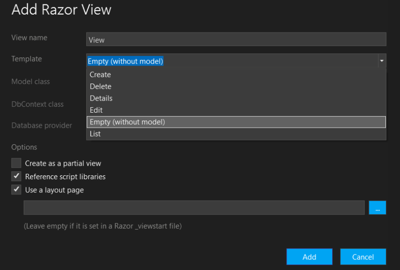


I chose the Template and the ViewModel That will apply for it 

---
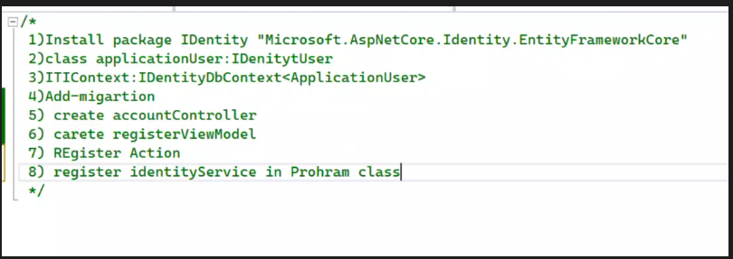

- the steps that is  listed form the core sequence to implement an authentication module using **ASP.NET Core Identity with Entity Framework Core**. However, to ensure your authentication module is complete and functional, :

    - 1. Install package Identity "Microsoft.AspNetCore.Identity.EntityFrameworkCore"

    - 2. class ApplicationUser : IdentityUser

    - 3. ITIContext : `IdentityDbContext<ApplicationUser>`
 
    - 4. Add-migration

    - 5. Create AccountController (Adding user manager , sign in manager  by DI) 

    - 6. Create RegisterViewModel
 
    - 7. Register Action

    - 8. Register IdentityService in Program class
 

---
***Note :***
- Identity For Password Has Some Strict Condition like :
  **Password Requirements:**

    - Minimum 6 characters
    
    - At least one non-alphanumeric character (e.g., !, @, #, etc.)
    
    - At least one digit (0-9)
    
    - At least one uppercase letter (A-Z)

- We Can edit these requirements by (At Program.cs):
``` csharp
builder.Services.AddIdentity<ApplicationUser, IdentityRole>(option =>
{
    option.Password.RequiredLength = 4;
    option.Password.RequireDigit = false;
    option.Password.RequireNonAlphanumeric = false;
    option.Password.RequireUppercase = false;
}).AddEntityFrameworkStores<ITIContext>();
```

- When using  `[Authorize]` We need To use `app.UseAuthentication();` middleware at programe.cs before ` app.UseAuthorization();`

##  `app.UseAuthorization();`:

- It checks:
    
    - "Does the incoming request have any **authentication data** like:
        
        - a Cookie,
            
        - a JWT Token,
            
        - or any other authentication method?"
            
- If it **finds data** :
    
    - It **verifies** it (e.g., checks if the token or cookie is valid).
        
    - If valid ➔ it **fills `HttpContext.User`** with the user info (like username, roles, claims, etc.).
        
- If **nothing is found** or it's invalid :
    
    - The request continues with the user as **Anonymous**.
        

 So, it's responsible for **checking and loading who the user is**.

---

##  `[Authorize]`:

**What does it do?**

- After `UseAuthentication()` finishes and has loaded the user info, `[Authorize]` comes in and says:
    

> "Alright, the current user:
> 
> - Are they **authenticated**?
>     
> - Do they have the required **roles or permissions** (if specified)?"
>     

- If everything is good  it allows access.
    
- If the user is **not logged in** , returns 401 Unauthorized.
    
- If logged in but **missing required role/permission** , returns 403 Forbidden.
    

 - So, it's responsible for **authorizing access based on user info.**
  - We _usually_ need both together if you're using `[Authorize]`.

---
##  To summarize what you said (which is correct):

-  `UseAuthentication`: **checks if there’s a cookie (or token) and verifies it.**
    
-  `[Authorize]`: **checks the loaded user info to decide if access is allowed.**
----
- To Make Sign out (Delete Cookies ):

``` csharp
 public async Task<IActionResult> SignOut()
 {
     await signInManager.SignOutAsync();
     return View("Login");
 }
```

- Will Delete User Cookie For Identity
-------
-  How We Login Again :
``` csharp
  [HttpPost]
  [ValidateAntiForgeryToken]
  public async Task<IActionResult> SaveLogin(LoginUserViewModel userViewModel)
  {
      if (ModelState.IsValid==true)
      {
          //check found 
          ApplicationUser appUser=
              await userManager.FindByNameAsync(userViewModel.Name);
          if (appUser != null)
          {
             bool found=
                  await userManager.CheckPasswordAsync(appUser, userViewModel.Password);
              if(found==true)
              {
                  await signInManager.SignInAsync(appUser,userViewModel.RememberMe);
                  return RedirectToAction("Index", "Department");
              }
              
          }
          ModelState.AddModelError("", "Username OR PAssword wrong");
          //create cookie
      }
      return View("Login", userViewModel);
  }

```

``` csharp
   ApplicationUser appUser=
              await userManager.FindByNameAsync(userViewModel.Name);
```
- it returns the User of `ApplicationUser` type if Found it , if not will return null

``` csharp
bool found=  await userManager.CheckPasswordAsync(appUser, userViewModel.Password);
```
- Make Re-hash For Password and compare it 
---
- Controllers in ASP.NET Core **inherit** some properties from the `ControllerBase` or `Controller` class (depending on the type of controller). These properties are automatically available to the controller without any additional setup. Specifically:
     1- ViewData
     
     2- ViewBag
    
	 3- **`User`** ,  **Type**: `ClaimsPrincipal`
      
    -   The `User` property represents the **current authenticated user**. It contains   information about the user's identity and claims (like roles, email, etc.), If No Authentication Found it Becomes ***`Null`*** 
      
    - **Inheritance**: `User` is inherited from `ControllerBase` (which is the base class for controllers).
    
      - ###  **`ClaimsPrincipal`**:
       In ASP.NET Core, **`ClaimsPrincipal`** is the class used to represent the **current authenticated user** and contains all the claims associated with that user. The claims provide key information about the user, such as their roles, email address, and any other custom attributes related to their identity.

       - **`ClaimsPrincipal`** provides:
       1- **Identity**: Basic information about the user (like username).
       2- **Claims**: A collection of ***<span style="color:gold">key-value pairs</span>*** containing the user's information, such as roles, permissions, email, etc.
    
    ***Example :***
``` csharp
 public IActionResult TestAuth()
 {
     if (User.Identity.IsAuthenticated == true)
     {
         
         Claim IDClaim= User.Claims
             .FirstOrDefault(c => c.Type == ClaimTypes.NameIdentifier);

         Claim AddressClaim = User.Claims.FirstOrDefault(c => c.Type == "UserAddress");

         string id = IDClaim.Value;
         string address = AddressClaim?.Value ?? "Address not available";
         string name = User.Identity.Name;
         return Content($"welcome {name} \n ID= {id}");
     }
     return Content("Welcome Guest");
 }
```

- `User.Identity.IsAuthenticated == true` Used To Get The Authentication like `[Authorize]

-  ` string name = User.Identity.Name;` used to get the Name
- To Get Other Properties by :
     - We Deal With User as context , Claims as Class in it , then use the needed property 
     - Claims returns Type of `IEnumerable`
     - `NameIdentifier` is part of standard identity claims but `"UserAddress"` is A Custom Claim
   
``` csharp
    Claim IDClaim= User.Claims
             .FirstOrDefault(c => c.Type == ClaimTypes.NameIdentifier);

         Claim AddressClaim = User.Claims.FirstOrDefault(c => c.Type == "UserAddress");
```
   
***Example***:
1- Identity :
```lua
User.Identity.IsAuthenticated;
User.Identity.Name;
User.Identity.AuthenticationType;
```


2- Claims :

|Claim Type|ClaimTypes Constant|Example Value|
|---|---|---|
|Name|`ClaimTypes.Name`|`jdoe`|
|Name Identifier (User ID)|`ClaimTypes.NameIdentifier`|`12345`|
|Email|`ClaimTypes.Email`|`jdoe@example.com`|
|Role|`ClaimTypes.Role`|`Admin`|
|Given Name|`ClaimTypes.GivenName`|`John`|
|Surname|`ClaimTypes.Surname`|`Doe`|
|Date of Birth|`ClaimTypes.DateOfBirth`|`1990-01-01`|
|Gender|`ClaimTypes.Gender`|`Male`|
|Mobile Phone|`ClaimTypes.MobilePhone`|`+1234567890`|
|Country|`ClaimTypes.Country`|`US`|
|Locality (City)|`ClaimTypes.Locality`|`New York`|
|Street Address|`ClaimTypes.StreetAddress`|`123 Main St`|
|Postal Code|`ClaimTypes.PostalCode`|`10001`|
|Website|`ClaimTypes.Webpage`|`https://example.com`|
|Authentication Method|`ClaimTypes.AuthenticationMethod`|`Password`|
|Security Stamp (if using ASP.NET Identity)|_Custom, often named "AspNet.Identity.SecurityStamp"_|(GUID)|

- ## How Can We Add Custom Claims 
1- Make Collection of Claims 
2- Add needed Claim to created collection 
3- use <span style="color:gold">SignInWithClaimsAsync</span> and add Appuser , boolen for long term cookie and collection of claims

``` csharp
 List<Claim> Claims = new List<Claim>();
 Claims.Add(new Claim("UserAddress",appUser.Address));

 await signInManager.SignInWithClaimsAsync(appUser, userViewModel.RememberMe, Claims);
```

- #### To get it :
``` csharp
var userAddress = User.FindFirst("UserAddress")?.Value;
//or
Claim AddressClaim = User.Claims.FirstOrDefault(c => c.Type == "UserAddress");

```

---
- ## How Can Add Role
- To Add Role to DataBase We Use <span style="color:gold">IdentityRole</span> so we Make an inject for it at Controller 
- then :
``` csharp
 IdentityRole role = new IdentityRole();
 role.Name = "Admin";
 IdentityResult result= await roleManager.CreateAsync(role);
 if (result.Succeeded == true)
 {
     ViewBag.sucess = true;
     return View("AddRole");
 }

  foreach (var item in result.Errors)
  {
      ModelState.AddModelError("", item.Description);
  }
  //code
```

- ## Add Role To User
- 
``` csharp 
 IdentityResult result= 
 await userManager.CreateAsync(appUser,UserViewModel.Password);
 if (result.Succeeded)
 {
     //assign to role
     await userManager.AddToRoleAsync(appUser, "Admin");
     // or
     await userManager.AddToRolesAsync(appUser, new[] { "Admin", "Manager" });
     //Cookie
     await signInManager.SignInAsync(appUser, false);
     return RedirectToAction("Index", "Department");
 }
```

- If you want to **restrict access** so that **only users in the `Admin` role** can access a controller or an action, you use:
``` csharp
[Authorize(Roles = "Admin")]
public class AdminController : Controller
{
    public IActionResult Dashboard()
    {
        return View();
    }
}
```

- To check if User Has a specific Role
``` csharp
if (User.IsInRole("Admin")){}
```

**When you assign a role to a user (e.g., with `AddToRoleAsync`):**

-  A new record is created in the `AspNetUserRoles` table.
    
-  This table acts as a **join table** between:
    
    - `AspNetUsers` (your users)
        
    - `AspNetRoles` (your roles)
        

 So , it **creates a foreign key relationship** between the user and the role.

---

 **At login time:**

- The system **queries that table** to find out which roles the user belongs to (following those foreign key links).
    
- It **creates claims for each role** and **loads them into the user’s identity (ClaimsPrincipal).**
    
- Those claims are **stored in the authentication cookie** (or token).
    
- - **Roles → Claims → ClaimsPrincipal → User.**
  
- On every request:
    - The `ClaimsPrincipal` is rebuilt from the cookie/token and made available via `User` in controllers.
---
 
 **After login:**
 
- When you call:
  ``` csharp
    User.IsInRole("Admin")
    ```

- it **does NOT hit the database.**
- Instead, it **checks the user's already-loaded claims** (from the cookie/session) to see if `"Admin"` is there.

---
**Important reminder:**  
If you assign a role to a user **after they’ve already logged in,** the user won’t see the new role until they **log out and log in again,** unless you force the claims to refresh.
 
 
---
##                                     Day 9
**1️- Partial View:**

-  **A small, reusable Razor view.**
    
-  **Included in a larger view to render part of the page.**
    
    - Think of it like a **view _without_ its own layout** (no full page structure).
        
-  **Often used for:**
    
    - Reusable UI pieces (e.g., a product card, menu, footer).
        
    - Keeping code clean and modular.
        
    - Loading content dynamically via AJAX (e.g., updating a section without full reload).
        

---

** How to create:**

- The process is the **same as creating a normal view.**
    
- ✅ Just **check the option "Create as a partial view"** (in Visual Studio, for example).

 - 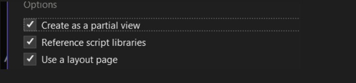

 ---
 - it is recommended to start partial view with " _ " like `_EmoCard.cshtml

``` csharp
@model Employee

<h1>@Model.Name</h1>
<h2>@Model.DepartmentID</h2>
<h2>@Model.Salary</h2>
<h2>@Model.Address</h2>

```
##  Why you **don’t include things like:**

- `ViewData`
    
- `<head>` tags
    
- `<script>` or `<link>` includes (like jQuery, CSS)
    

 **Because:**
 
- The **partial view is _injected into_ a main view.**
    
- The **main view already has the full layout:**
    
    - HTML `<head>`, `<body>`, title, scripts, styles, etc.
        
- The partial view is meant to **focus only on the small section of content** it is responsible for. 
 
 - As we see it can easy take a Model 
 
 - #### **To include a Partial View in the Main View:
 
**1️⃣ Using HTML Helper:**
``` csharp
@Html.Partial("_NavPartial")
```

OR (recommended for async):
``` csharp
@await Html.PartialAsync("_NavPartial")
```

OR using **RenderPartial** (writes directly to the output stream):
``` csharp
@{   
Html.RenderPartial("_NavPartial");
//or 
await Html.RenderPartialAsync("_NavPartial"); 
}
```
✅ **Notes:**

- `Html.Partial()` returns an `IHtmlContent` (you output it).
    
- `Html.RenderPartial()` writes directly to the response stream (slightly more efficient but less flexible in Razor pages).
    

---

**2️⃣ Using Tag Helper ( _recommended_ for Razor Pages and MVC):**

``` csharp
 <partial name="_NavPartial" />
```

---

## **Note:**
 by default A **partial view** will **inherit the model** from the **parent (main) view** **unless you explicitly pass a different model.**

##### -  What if you want to pass a **different model**?
You can **explicitly pass a model** when rendering:

1- By Tag Helper :
``` csharp
<partial name="_EmployeeDetails" model="Model.EmployeeDetails" />
```
`model` is an attribute , then pass it the new model you need 

2- By Html Helper :
``` csharp
@await Html.PartialAsync("_EmployeeDetails", Model.EmployeeDetails);
```

---
- At Action I Can Return a partial view :
``` csharp
public IActionResult EmpCardPartial(int id)
{
return PartialView("_EmpCard",EmployeeRepository.GetById(id));//Model=Null
}

```

## We have a Question why we return a partial view ?

**We return a partial view:**

-  **When we don’t want to refresh the whole page**  
    ➔ This is where **AJAX** comes in: you send an AJAX request, and the server returns **only the partial view**, which JavaScript injects into the page dynamically.
    
-  **When we want to reuse a small, specific part of the UI in multiple places**  
    ➔ Even **without AJAX**, you can render partial views **inside other views** to avoid repeating code.


---
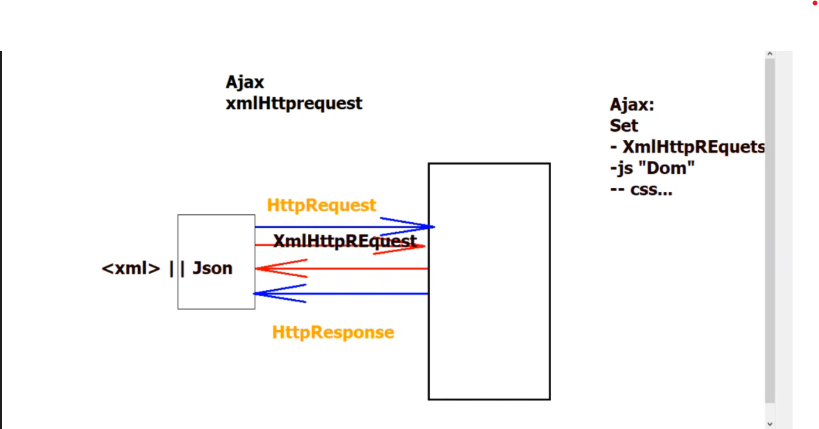

 
 - ###  AJAX Request
  - it's used to update part of the page without reloading the whole thing.
  
  - ## But technically:

- **The HTTP request itself is a _full request_.**
    
    - When you send an AJAX request using `XMLHttpRequest`, it **goes through the full HTTP pipeline:**
        
        - The browser sends **full HTTP headers, cookies, and body** (if applicable).
            
        - The server (like ASP.NET) sees it as a **normal HTTP request**.
            
- What makes it **feel "partial"** is **how you _handle the response on the client side._**
    
    - Instead of reloading the **whole page** (like with a normal form submission),
        
    - You **use JavaScript to update just part of the page** (e.g., a `<div>`, a table, a form section)

- **XmlHttpRequest:**  
    ➔ This is the JavaScript object that **creates and manages AJAX requests.** and received ***XML or JSON***  
- **js "Dom":**  
    ➔ After the response is received, **JavaScript updates the DOM (HTML content)** dynamically.
- **CSS:**  
    ➔ You can also manipulate CSS (styles) as part of the dynamic update.

|**Aspect**|**Normal HTTP Request**|**AJAX (XMLHttpRequest / Partial Request)**|
|---|---|---|
|Request type|Full HTTP request|Full HTTP request|
|How it's sent|Browser reload or form submit|JavaScript sends it (in background)|
|Page reload?|Yes, whole page reloads|No, page stays as is|
|What updates on the page?|Entire page is replaced with server response|Only parts of the page are updated via JavaScript|
|Example|Submitting a contact form that reloads the page|Submitting a form and showing success without reload|
|Headers & body|Full HTTP headers and body|Full HTTP headers and body|
|Use case|Full page navigation|Dynamic page updates (e.g., live search, chat updates)|

To implement Ajax :
``` csharp
@model List<Employee>
@{
    ViewData["Title"] = "Index";
}

<h1>Index</h1>
<a asp-action="New" asp-controller="Employee">NEw</a>


<div id="div1" style="border:2px solid blue"></div>


<table class="table table-bordered table-hover">
    <tr>
        <th>ID</th>
        <th>Name</th>
        <th>SAlary</th>
        <th></th>
    </tr>
    @foreach (var item in Model)
    {
        <tr>
            <td>@item.Id</td>
            <td>@item.Name</td>
            <td>@item.Salary</td>
            <td>
                <a href="/Employee/Edit/@item.Id">Edit</a>
            </td>
            <td>
                <a href="/Employee/EmpCardPartial/@item.Id" onclick="GetEmpData(@item.Id)">Details</a>
            </td>
        </tr>
    }

</table>


<script src="~/lib/jquery/dist/jquery.js" ></script>
<script>
    function GetEmpData(EmpID) {
        event.preventDefault();
       
		//Ajax Call Endpont using jquery
        $.ajax({
            url: "/Employee/EmpCardPartial/" + EmpID,
            success: function (result) {
                console.log(result);
                $("#div1").html(result);
            }
        });

    }
</script>
```

1- We make a div with id=""div1" to get the partial view on it 
2- to use client side we used JS and Jquery , so we uploaded `Jquery`
3- We used ` event.preventDefault();` ➔ to stop the anchor tag’s default behavior** (which is to make a full-page HTTP request to the `href` URL).
4- using Ajax Call by Jquery by  a popular ready code:
``` csharp
        $.ajax({
            url: "/Employee/EmpCardPartial/" + EmpID,
            success: function (result) {
                console.log(result);
                $("#div1").html(result);
            }
        });
```
- We put Wanted URL ,and Dom for Wanted Div 
- So We have made an ajax Call
 
- -----------------
Example using `AJAX`:
	1- I want to make 2 drop-down lists , one for `Department` and other for `Employees`
		at selected department 

1- I load all Departments at Model
2- add method for Employee to return all Department Id
3- at department I return all employee result as a `JSON` file
4- use Jquery and JS to make Partial Request

 1- Employee 
``` csharp
public List<Employee> GetByDEptID(int deptID)
{
    return context.Employee.Where(e=>e.DepartmentID== deptID).ToList();
}
```

2- at Department Controller
```csharp
 public IActionResult GetEmpsByDEptId(int deptId)
 {
     List<Employee> EmpList= EmployeeREpo.GetByDEptID(deptId);
     return Json(EmpList);
 }
```

3- at Department View
``` csharp
@model List<Department>
@{
    ViewData["Title"] = "DeptEmps";
}

<h1>DeptEmps</h1>

<select id="DeptId" name="DeptID" class="form form-control" onchange="GetEmp()">
    @foreach(var deptItem in Model){
        <option value="@deptItem.Id">@deptItem.Name</option>
    }
</select>
<br />
<select id="Emps" name="Emps" class="form form-control">
</select>


<script src="~/lib/jquery/dist/jquery.min.js"></script>
<script>
    function GetEmp() {
        var deptID= document.getElementById("DeptId").value;
        var empElement = document.getElementById("Emps");
        empElement.innerHTML = "";
        console.log(deptID);
        //Ajax call json

        $.ajax({
            url: "/DEpartment/GetEmpsByDEptId?deptId=" + deptID
            , success: function (result) {
                console.log(result)
                for (let emp of result) {
                    empElement.innerHTML += "<option value='" + emp.id + "'>" + emp.name + "</option>";
                }

            }
        });
    }
</script>


```

- First We Loaded All Departments, and use `onChange()` to every time I change the selected department I load it's employees by `GetEmp()` function
``` csharp
<select id="DeptId" name="DeptID" class="form form-control" onchange="GetEmp()">
    @foreach(var deptItem in Model){
        <option value="@deptItem.Id">@deptItem.Name</option>
    }
</select>
```

 - Then We make an Empty Select To load all Employee Related To Selected Department 
``` csharp
<select id="Emps" name="Emps" class="form form-control"></select>
```

- We use Jquery
``` csharp
<script src="~/lib/jquery/dist/jquery.min.js"></script>
<script>
    function GetEmp() {
        var deptID= document.getElementById("DeptId").value;
        var empElement = document.getElementById("Emps");
        empElement.innerHTML = "";
        console.log(deptID);
        //Ajax call json

        $.ajax({
            url: "/DEpartment/GetEmpsByDEptId?deptId=" + deptID
            , success: function (result) {
                console.log(result)
                for (let emp of result) {
                    empElement.innerHTML += "<option value='" + emp.id + "'>" + emp.name + "</option>";
                }
            }
        });
    }
</script>
```
`result` s the **data returned by the server when the AJAX request completes successfully**.

Here’s what happens step-by-step:

1. **The browser sends a request** to `/DEpartment/GetEmpsByDEptId?deptId=...`.
    
2. **Your server handles that request** and returns a response—usually JSON if you’re dealing with data.
    
3. **`result` holds that response data** (e.g., an array of employee objects like `[{ id: 1, name: 'Alice' }, ...]`).
4. I Add The response values to the empty select 
---
- ## Routing 
   - What is Routing :
   **routing** refers to the system that **maps incoming HTTP requests to specific code**—typically controllers, actions, Razor pages, or endpoints.

###     What it means:

- When a user visits a URL like `/products/details/5`, routing figures out **which controller and action** (or page) should handle that request.
    
- The routing system **parses the URL** and **binds parameters** (like the `5` in the example) to your method’s parameters.


Routing is doing by 2 types :

- 1- **convention-based routing** :You can use **convention-based routing** (via route    templates like `{controller}/{action}/{id?}`) 
- 2- **attribute routing** (via `[Route()]` attributes).

---
## 1- ***Convention-based routing***
  - We need to know about URL 
    1- `/` ➔ called a delimiter
    2- /.../   or  /emp/ ➔ called Segmrnt
  - so , **Convention-based routing** means:

- You define a **general pattern** (a _convention_) that tells ASP.NET **how to map URLs to controller actions**.
    
- URLs that follow this **pattern** automatically map to your code **without needing special route definitions for each one.** 
- pattern 
``` csharp
pattern: "{controller}/{action}/{id?}"
```
- `{controller}` → the **name of the controller** (minus `Controller`).
    
- `{action}` → the **method (action)** inside that controller.
    
- `{id?}` → an **optional parameter** (like a record ID).

- the **pattern** can include:

   1️⃣ **Placeholders**  
   2️⃣ **Literals**

---

## 1️⃣ **Placeholders (Route Parameters)**

These are **variable parts** of the URL, written inside `{ }`.

➡️ Examples:

- `{controller}`
    
- `{action}`
    
- `{id}`
    

 **What they do:**

- **Capture part of the URL** and map it to a value.
    
- Are **dynamic**—they change based on what’s in the URL.
    

---

**Example pattern:**

``` csharp
`"{controller}/{action}/{id?}"`
```
**URL:** `/Products/Details/5`

|Part of the URL|Placeholder it matches|
|---|---|
|`Products`|`{controller}`|
|`Details`|`{action}`|
|`5`|`{id}`|

---

## 2️⃣ **Literals (Fixed Parts)**

These are **hardcoded parts** of the pattern. They are **static** and must **exactly match** part of the URL.

➡️ Examples:

- `shop`
    
- `products`
    
- `api`
    

 **What they do:**

- Must **be present in the URL** exactly as written.
    
- Are **not dynamic**—if the literal doesn't match, the route won’t match.
---
To enable routing, you need to call:

``` csharp
app.UseRouting();
```

This **adds the routing middleware** to the pipeline. It tells ASP.NET Core:

> “We are going to process incoming URLs and match them to routes.”

Without `UseRouting()`, **no routing will work.**

- #### then We can customize our Routing 
- Example :
At Program .cs
``` csharp
app.MapControllerRoute("Route2", "R2",
              new { controller = "Route", action = "Method2" }
   );
```

At Route Controller
``` csharp
   public IActionResult Method2()
   {
       return Content("M2");
   }
```


The **first parameter** of `MapControllerRoute()` is a **name for the route**. In this case, `"Route2"` is simply a **name** for the route being defined , <span style="color:gold"> it must be unique.</span>
### Here's how it breaks down:

1. **`"Route2"`** – This is the **name** of the route. It’s an identifier that you can use to reference or manage this route later, but it **doesn’t affect the URL matching** directly. It's mainly for **internal reference**.
    
2. **`"R2"`** – This is the **URL pattern** that will be used to match incoming requests. So, any request to `/R2` will be mapped to this route.
    
3. **`new { controller = "Route", action = "Method2" }`** – This part defines the **controller** and **action** that will be invoked when the route is matched:
    
    - **Controller:** `RouteController`
        
    - **Action:** `Method2`
        
4. We can Directly Write for the URL `/R2/` then Will go to Wanted Method 
### **How Does It Work?**

- When someone visits `/R2` in the browser, this route is triggered.

- The request will then be directed to the **`RouteController`** and will invoke the **`Method2`** action inside that controller.


- if the method receives an attribute like :
``` csharp
   public IActionResult Method2(string name)
   {
       return Content("M2");
   }
```
we use :
``` lua
/R2?name=ali
```
- attribute must be sane name as called in url 

- We Can Add constrains like :

| **Constraint** | **Description**                                                         | **Example**                         |
| -------------- | ----------------------------------------------------------------------- | ----------------------------------- |
| alpha          | Matches uppercase or lowercase Latin alphabet characters (a-z, A-Z)     | `{x:alpha}`                         |
| bool           | Matches a Boolean value.                                                | `{x:bool}`                          |
| datetime       | Matches a **DateTime** value.                                           | `{x:datetime}`                      |
| decimal        | Matches a decimal value.                                                | `{x:decimal}`                       |
| double         | Matches a 64-bit floating-point value.                                  | `{x:double}`                        |
| float          | Matches a 32-bit floating-point value.                                  | `{x:float}`                         |
| guid           | Matches a GUID value.                                                   | `{x:guid}`                          |
| int            | Matches a 32-bit integer value.                                         | `{x:int}`                           |
| length         | Matches a string with the specified length or within a specified range. | `{x:length(6)}`, `{x:length(1,20)}` |
| long           | Matches a 64-bit integer value.                                         | `{x:long}`                          |
| max            | Matches an integer with a maximum value.                                | `{x:max(10)}`                       |
| maxlength      | Matches a string with a maximum length.                                 | `{x:maxlength(10)}`                 |
| min            | Matches an integer with a minimum value.                                | `{x:min(10)}`                       |
| minlength      | Matches a string with a minimum length.                                 | `{x:minlength(10)}`                 |
| range          | Matches an integer within a range of values.                            | `{x:range(10,50)}`                  |
| regex          | Matches a regular expression.                                           | `{x:regex(^\d{3}-\d{3}-\d{4}$)}`    |
- like :
``` csharp
app.MapControllerRoute("Route2", "R2/{name}/{age:int}",
              new { controller = "Route", action = "Method2" }
   );
```

- makes third segment name must be same for for method attribute 
    like :
``` csharp
 public IActionResult Method2(string name)
 {
     return Content("M2");
 }
```

``` csharp
app.MapControllerRoute("Route2", "R2/{name}",
              new { controller = "Route", action = "Method2" }
   );
```
- Will pass attribute value by `/name`

- We can also make segment is optional like 
``` csharp
app.MapControllerRoute("Route2", "R2/{age:int}/{name?}",
              new { controller = "Route", action = "Method2" }
   );
```

- we should make optional segment the last segment 
- we can make default value for the segment by :
``` csharp
app.MapControllerRoute("Route2", "R2/{name=ali}",
              new { controller = "Route", action = "Method2" }
   );
```

- ## ***Note :***
- Most Customized Route must be first then we put default Route
- 
``` csharp
app.MapControllerRoute("Route2", "R2/{controller}/{action}");
```
- Here We can use Controller , Action For URL , it is the default for Microsoft so , We can put it at last 
---
## 2- _**Attribute-based routing**_ (also called **attribute routing**)

1- before the Action 
``` csharp
   [Route("M1/{age:int}/{name?}",Name ="R1")]
   public IActionResult Method1()//string name,int age)
   {
       return Content("M1");
   }
```

1- it takes the Routed URL , and name of Route

- ## Note:
- _**Attribute-based routing_ : used Most For API
- 2- ***Convention-based routing*** : Used Most For MVC   
----
- ## How Can I Make Deployment 
- 1- Right Click on project name 
- 2- choose publish 
- 3- choose Folder if we don't Have Azure or Docker 
- 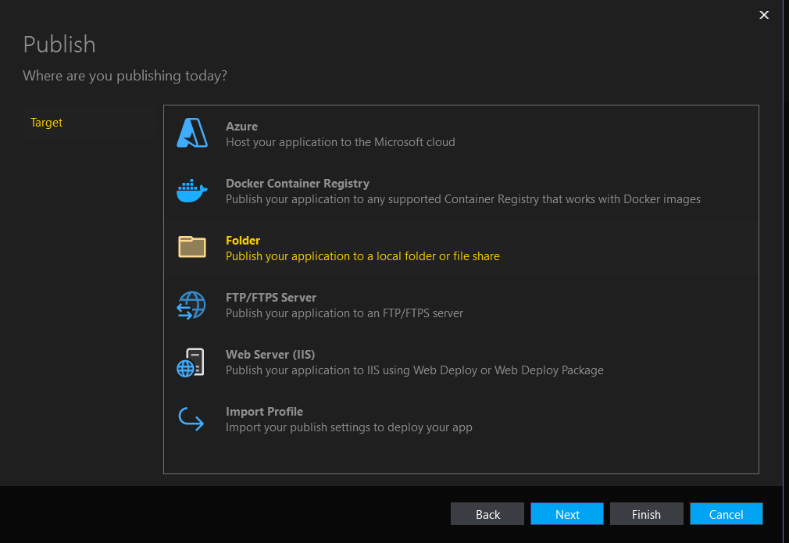
- 4- then choose location 
- 5- choose setting 
- 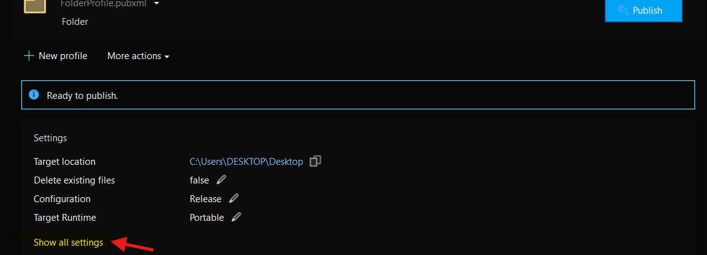
- 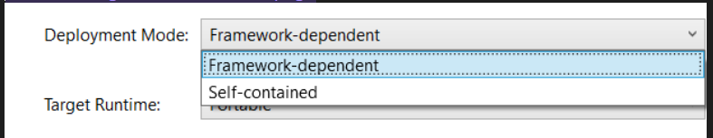
- 6- We have 2 options :
	- 1- Framework-dependent :if host has the runtime
	- 2- Self-contained: download all runtime requirement if host does not have the runtime 
- 7-click save .
- -----
- ## We Finished （*＾-＾*）
